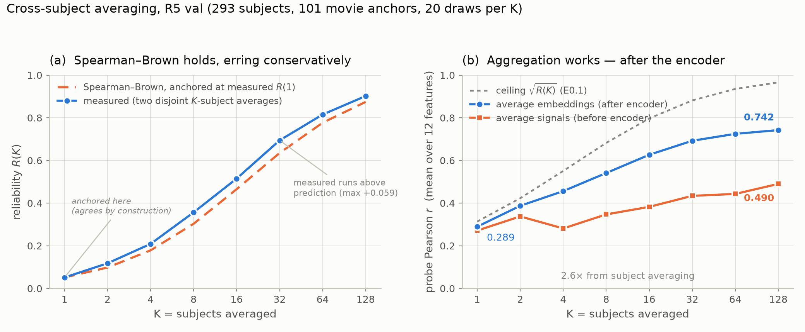
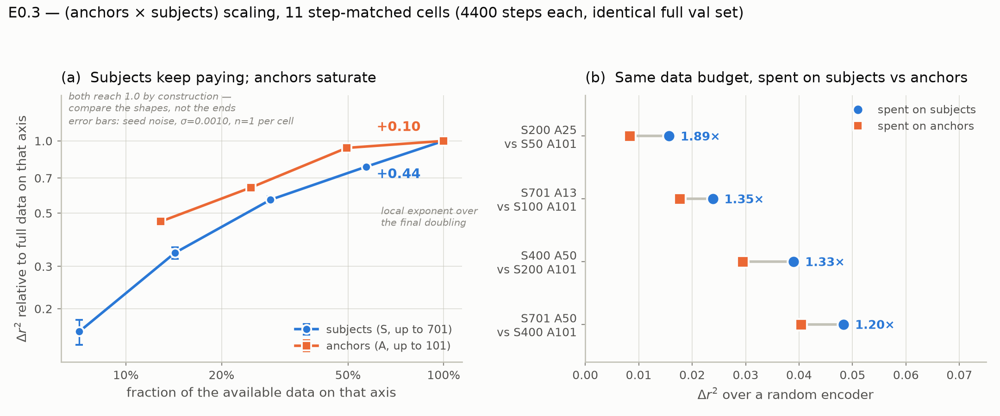

# snr_scaling — RESULTS

Measured noise ceilings for stimulus-locked EEG readout on HBN movie-watching.
Establishes what fraction of the achievable signal the CLIP/JEPA checkpoints in
[`soft_target_clip`](../clip_pretraining/soft_target_clip/RESULTS_jul7.md) and
[`cs_aligner`](../clip_pretraining/cs_aligner/RESULTS_jul9.md) actually capture,
so results can be reported as *r*/ceiling rather than raw *r*.

Forward-looking experiment design lives in [`PLAN.md`](PLAN.md); this file is
the record of what has been measured. Commits `b4492fe`, `6dd992d`, `fdf0b3b`.

---

## TL;DR

1. **The single-trial ceiling on R5 val is *r* = 0.313.** Cross-validated
   CorrCA gives a combined 5-component reliability of `rho1 = 0.0982`; the
   Spearman-Brown / Schoppe ceiling is `sqrt(rho1) = 0.313`.
2. **The best checkpoint sits at 83–88 % of it** — Schoppe CC_norm = **0.826**
   on val (*r* = 0.2584 / 0.313) and **0.882** on test (*r* = 0.1517 / 0.172).
   ⚠️ An earlier version of this file reported 0.484 by comparing the **test**
   *r* against the **val** ceiling. That was a split mismatch; see §2.2.
3. **Single-trial headroom is only ~1.15–1.2×, not ~2×.** Four objectives
   tying within ±0.003 Δr²
   ([jul7 §4.1](../clip_pretraining/soft_target_clip/RESULTS_jul7.md)) is
   consistent with a genuine ceiling effect after all. The ceiling is still a
   *lower* bound (only 5 CorrCA components), so "provably at ceiling" is not
   established either — but the earlier claim that the ceiling hypothesis was
   "falsified" rested on the mismatched comparison and is withdrawn.
4. **Three independent estimators agree** to within ~0.005 across all bands —
   Sahani-Linden explainable variance, Hsu-style split-half, and mean pairwise
   ISC. The ceiling is a property of the data, not of one estimator.
5. **δ/θ ≫ α is confirmed but 2–5× smaller than the repo has been citing.**
   Measured best-channel δ/θ = 0.062 vs α = 0.029 (2.1×);
   [`experiments.md` § "Core Problem Identified"](../../experiments.md#core-problem-identified) cites 0.10–0.28 vs
   <0.05. **Quote the measured numbers.**
6. **Test-time subject aggregation is worth far more than any objective, and
   this is now measured rather than extrapolated** (E0.2, §2.8). Probe *r*
   rises **0.289 → 0.742** from K=1 to K=128 — a **2.6× gain**, monotone, not
   saturating — against ~1.15–1.2× of single-trial headroom left. Spearman-Brown
   is validated to within 3–20 %, converging to 3 % at K=128, and the deviation
   errs *upward*, the opposite of the failure mode the test was built to catch.
7. **Aggregate AFTER the encoder, not before** (§2.8). Embedding-space averaging
   beats signal-space at every K and the gap widens (0.742 vs 0.490 at K=128);
   signal-space is even non-monotonic. The encoder is strongly non-linear in the
   noise, so **classical ERP-style signal averaging is the wrong aggregation
   point for a learned encoder**.
8. **Subjects buy SNR; seconds do not.** Measured directly on Top-K retrieval
   (§2.6): scene Top-1 goes 0.217 → 0.571 with subject averaging, but pooling
   more seconds *within* a subject gains ~0.015 and then degrades — and the
   oracle-segment upper bound confirms that is the ceiling, not a blocking
   artifact. This closes the free alternative to collecting subjects.
9. **The retrieval metric hides a collapse** (§2.7): the model answers "scene 0"
   — the black title card — for 40.6 % of test windows while it is correct 5.0 %
   of the time. Report the modal-answer share alongside Top-K.
10. **The ceiling replicates on a second movie with the same subjects** (§2.9).
   DespicableMe gives `rho1 = 0.0922`, ceiling **0.304** vs ThePresent's 0.313 —
   a 3 % difference — and the δ/θ-over-α ratio replicates at 3.06 vs 2.84. The
   cohorts are 98.9 % shared, so stimulus is the only thing varying. Say
   "replicates across movies within HBN," not "replicates."
11. ⚠️ **E0.3 ran, but its exponents are PROVISIONAL** (§2.10). Every cell
   overfits, worse with less data (val AUC drops 15 % at S=701 vs 31 % at S=50,
   40 % at A=13), which is the exact bias that inflates a scaling exponent. The
   *ordering* below holds at each cell's peak; the magnitudes do not. Re-running
   early-stopped. Original endpoint-based text follows:
12. **E0.3 ran; the thesis survived its own falsification test** (§2.10). Across
   11 step-matched cells, Δr² scales with subjects (local exponent **+0.441** at
   the operating point, still climbing at S=701) and saturates in anchors
   (**+0.096** over A=50→101) — a **4.6× ratio**. Model-free version: at a
   matched (subjects × anchors) budget, subject-heavy beats anchor-heavy **4/4,
   median 1.34×**, twice while using *fewer* total pairs. Caveat: n=1 seed, and
   the A saturation step is only ~3.4σ against jul7's seed noise.
13. Two artifacts found and fixed that would have corrupted the headline: a flat
   reference channel faking ISC ≈ 0.4, and CorrCA component 1 failing to
   generalise despite the largest in-sample eigenvalue — the latter now known to
   be **rank-unstable across movies** (§2.9), which is a stronger reason to avoid
   any fixed-rank component statistic.

---

## §1. Setup

### 1.1 What is being measured

Model the response of subject *s* at movie moment *t* as
`x_s(t) = g(t) + n_s(t)`, with `g` the shared stimulus response and `n` the
subject fingerprint plus noise, independent across subjects. Then

```
rho1 = Var(g) / (Var(g) + Var(n))
R(K) = K*rho1 / (1 + (K-1)*rho1)          (Spearman-Brown)
r(K) <= sqrt(R(K)) * corr(g, y)  <=  sqrt(R(K))
```

Because a frozen V-JEPA-2 movie feature is a *deterministic* function of the
stimulus, it carries no measurement noise, so `sqrt(R(K))` bounds the
correlation achievable by **any encoder under any objective**. Two facts make
this tractable: mean pairwise inter-subject correlation estimates `rho1`
exactly under this decomposition (no extra assumptions), and Schoppe's
`CC_max = sqrt(N*SP/(N*SP+NP))` is algebraically the same quantity.

### 1.2 The trial-axis caveat — read before citing

Sahani & Linden (2003), Hsu, Borst & Theunissen (2004) and Schoppe et al.
(2016) all assume **repeated presentations of the same stimulus to the same
subject**. HBN gives exactly one presentation per subject, so we use
**subjects as the repeat axis**: the "signal" is the cross-subject-shared
response, and the subject fingerprint is absorbed into the noise term.

That is the correct choice for bounding *stimulus* decoding — subject-specific
structure is precisely what must not count — and it makes these estimators
commensurable with ISC. But it means these are **cross-subject, not
cross-trial, ceilings**, and they are consequently far lower than a
within-subject repeated-trial ceiling.

### 1.2b Comparability to the neural-decoding literature — checked against sources

An earlier draft of this file claimed that NICE/THINGS-EEG, Défossez et al.
and Benchetrit et al. are all "trial-averaged image decoding" and therefore not
comparable. **That was wrong for two of the three.** Verified against the
papers:

| work | modality | stimulus | repeats | averaged? | training |
|---|---|---|---|---|---|
| NICE / THINGS-EEG (Song et al.) | EEG | discrete images | 4 train / **80 test** | **Yes, explicitly** | **per-subject** |
| Benchetrit et al. 2024 | MEG | discrete images | 12 test | **Both reported** | cross-subject |
| Défossez et al. 2023 | MEG **and EEG** | continuous speech | none used | **No — single-trial** | cross-subject |

- **NICE is genuinely trial-averaged and within-subject.** "We averaged all EEG
  repetitions of one image to ensure the signal-to-noise ratio"; the test split
  is 200 concepts × 1 image × **80 repetitions**. Averaging is load-bearing:
  10 repeats give 9.9 % top-1, stabilising above 13.0 % only after ~25.
  Subject-dependent training gives 13.8 % top-1 vs **6.2 % subject-independent**.
  Not comparable to single-trial cross-subject HBN — the original claim holds
  here.
- **Benchetrit et al. report both.** THINGS-MEG test is 200 images × 12
  repetitions, and Table 1 gives PixCorr 0.069 no-average, 0.079 per-trial
  average, 0.088 per-subject average. Averaging helps modestly; the headline
  does not depend on it. It is not comparable to our numbers chiefly because it
  is **MEG** and event-related, not because of averaging.
- **Défossez et al. is single-trial, and it is speech, not images.** "A 'sample'
  is a 3 s window of brain recording with its associated speech
  representation." No trial averaging. Trained across subjects with a
  subject-specific 1×1 convolution. Listing it as trial-averaged image decoding
  was wrong on both counts.

**Défossez et al. is therefore the closest methodological analogue to this
work** — cross-subject, single-trial, continuous naturalistic stimulus,
contrastive retrieval — and its modality breakdown is directly relevant:

| dataset | modality | top-1 | top-10 |
|---|---|---:|---:|
| Gwilliams | MEG | **41.3 %** | 70.7 % |
| Schoffelen | MEG | 36.8 % | 67.5 % |
| Brennan | **EEG** | **5.2 %** | 25.7 % |
| Broderick | **EEG** | **5.0 %** | 17.7 % |

The widely-quoted "41 % out of 1,000+ segments" is **MEG**. The same
architecture, same objective, same single-trial protocol yields **~5 % top-1 on
EEG** — an ~8× modality gap. That is independent evidence for the thesis here:
the binding constraint is EEG SNR, not the training objective. It is a stronger
argument than the averaging one, and unlike the averaging one it survives
checking.

The honest comparability statement is therefore: **NICE-style numbers are not
comparable because they are trial-averaged and within-subject; MEG results are
not comparable because MEG has far higher SNR than EEG; Défossez's EEG results
ARE comparable in protocol, and they are low — consistent with our ceiling.**

### 1.3 Data and protocol

| | val (R5) | test (R6) |
|---|---:|---:|
| recordings | 293 | 108 |
| unique subjects | 293 | 108 |
| shared anchors | 101 (202.0 s) | 101 |
| channels after flat-channel drop | 128 | 128 |

ThePresent, 2 s non-overlapping windows at 200 Hz. Recordings are joined on
**movie time** (`t_start_recordings`) — the same key
[`paired.py`](../../eb_jepa/datasets/paired.py) and `retrieval.py` use — and
the anchor set is the intersection across recordings, so every pairwise
correlation is computed on identical movie moments. Per-recording per-channel
z-scoring matches `norm_mode=per_recording` in the training configs, so the
ceiling is commensurable with the probe numbers it bounds.

Three readout spaces, because `rho1` depends on what the downstream model may
read: per-channel waveform, per-channel per-band window-level log power (the
probe's unit of analysis), and cross-validated CorrCA (the multivariate
reliability a ridge on a 512-d embedding can exploit).

---

## §2. Results

### 2.1 The ceiling

`rho1` candidates on R5 val, and the ceiling each implies:

| estimate | rho1 | K=1 | K=10 | K=50 |
|---|---:|---:|---:|---:|
| waveform, mean over channels | 0.0096 | 0.098 | 0.297 | 0.571 |
| waveform, best channel | 0.0228 | 0.151 | 0.435 | 0.734 |
| α band, best channel | 0.0289 | 0.170 | 0.479 | 0.773 |
| δ/θ band, best channel | 0.0620 | 0.249 | 0.631 | 0.876 |
| CorrCA, best held-out component | 0.0450 | 0.212 | 0.566 | 0.838 |
| **CorrCA, combined 5 components** | **0.0982** | **0.313** | **0.722** | **0.919** |

**Quote the combined CorrCA row.** A ridge probe on a 512-d embedding pools
multiple components rather than reading one, so the single-component figure is
a lower bound. Components are combined by SNR addition
(`SNR_i = rho_i/(1-rho_i)`, `R = ΣSNR/(1+ΣSNR)`).

### 2.2 Where the checkpoints sit

> ⚠️ **CORRECTED 2026-07-31.** The first version of this table compared **test**
> Pearson *r* against the **val** ceiling and reported CC_norm ≈ 0.48. Those are
> different splits and the comparison was invalid. The ceiling must be paired
> with *r* from the same split. The error was caught by E0.2 (§2.8), whose K=1
> point on val (*r* = 0.289) sits far above the 0.48 that a val ceiling of 0.313
> would have implied.

Schoppe CC_norm = CC_abs / CC_max, **same split on both sides**. Observed *r*
from the jul7 probe JSONs
([`probe_results/`](../clip_pretraining/soft_target_clip/probe_results/)):

| checkpoint | split | mean *r* | ceiling | CC_norm |
|---|---|---:|---:|---:|
| **soft τ=0.05 400 ep** | **val** | **0.2584** | 0.313 | **0.826** |
| vanilla CLIP 400 ep | val | 0.2485 | 0.313 | 0.794 |
| **soft τ=0.05 400 ep** | **test** | **0.1517** | 0.172 | **0.882** |
| vanilla CLIP 400 ep | test | 0.1459 | 0.172 | 0.848 |
| random init | test | 0.0527 | 0.172 | 0.306 |

The two splits agree: the best checkpoint captures **83–88 %** of the
attainable single-trial signal. Remaining single-trial headroom is
**~1.15–1.2×**, not the ~2× previously claimed.

`fresh500` and `reve_warmstart` are omitted rather than mis-paired — only test
*r* is on record for them, and the test ceiling is itself downward-biased
(§2.5), so their CC_norm would be an overestimate. Re-run their val probes
before quoting a normalised number.

**Caveat that cuts the other way:** 0.313 is a *lower* bound on the ceiling
(only 5 CorrCA components were computed), so a higher true ceiling would push
CC_norm back down. "Near ceiling" is the current best estimate, not a proof.
since only 5 components were computed.

### 2.3 Three estimators agree

R5 val, best channel per band. `SL(std)` is Sahani-Linden after per-subject
z-scoring; `split-half` is the Hsu-style estimator; `ISC` is mean pairwise
inter-subject correlation:

| band | SL(raw) | SL(std) | split-half | ISC | CC_max K=1 |
|---|---:|---:|---:|---:|---:|
| δ/θ | 0.0349 | **0.0609** | **0.0654** | **0.0620** | 0.247 |
| α | 0.0100 | **0.0283** | **0.0286** | **0.0289** | 0.168 |
| β | 0.0041 | **0.0296** | **0.0315** | **0.0302** | 0.172 |
| broadband | 0.0114 | **0.0510** | **0.0549** | **0.0521** | 0.226 |

Three independent routes — variance decomposition, resampling, correlation —
land within ~0.005. They fail in different ways, so agreement is meaningful
evidence rather than a tautology.

**The `SL(raw)` column is not an error; it is a measurement.** Sahani-Linden is
scale-*sensitive* across repeats (a high-variance subject inflates total power
and deflates SP/TP) while Pearson is scale-*invariant*. The gap therefore
quantifies between-subject amplitude heterogeneity — largest in β, where raw
SL is deflated 7× (0.0041 vs 0.0296). After per-subject z-scoring the two
coincide *exactly*: with `Var(x_n)=1`, `SP = (N*Var(mean)-1)/(N-1) = rho`.

**Quote the scale-invariant column.** This repo trains with
`norm_mode=per_recording`, so per-subject amplitude is not information the
encoder can use; charging it as noise would understate the ceiling. Quote
`SL(raw)` only for a model fed un-normalised amplitudes.

### 2.4 Band structure confirms the mechanism — at a smaller magnitude

Window-level log power, mean over channels (best channel in parentheses):

| band | val | test |
|---|---:|---:|
| δ/θ | 0.0396 (0.0620) | 0.0184 (0.0354) |
| β | 0.0164 (0.0302) | 0.0139 (0.0306) |
| α | 0.0139 (0.0289) | 0.0095 (0.0159) |
| broadband | 0.0315 (0.0521) | 0.0120 (0.0188) |

δ/θ exceeds α by 2.8× at the channel mean and 2.1× at the best channel,
consistently across splits. This **confirms** the mechanism asserted in
[`experiments.md` § "Core Problem Identified"](../../experiments.md#core-problem-identified) — stimulus signal lives
in δ/θ, while α dominates variance but is subject-specific.

**It also corrects the magnitude.** That file cites δ/θ ISC of 0.10–0.28 and
α < 0.05. At 2 s window-level log power the true values are 2–5× lower. The
qualitative claim survives; the numbers should be replaced with measured ones
wherever they appear.

### 2.5 Val and test disagree, and val is right

| | val | test |
|---|---:|---:|
| CorrCA fit / scored recordings | 146 / 147 | 54 / 54 |
| combined reliability | 0.0982 | 0.0297 |
| ceiling | 0.313 | 0.172 |
| mean *r*, soft τ=0.05 (same split) | 0.2584 | 0.1517 |
| CC_norm, soft τ=0.05 (same split) | 0.826 | 0.882 |

The test ceiling is **downward-biased by fit-set size**: CorrCA there estimates
128-channel covariances from 54 recordings, so its filters generalise poorly
and the held-out ISC understates the true reliability. The ceiling is a
property of the subject population, not of the split it was estimated on — so
**use the val estimate**. Expect a reviewer to notice both numbers; state this
explicitly rather than reporting only one.

### 2.6 Aggregation curves on the retrieval metric — subjects work, seconds do not

§4.2's K_test argument rests on a Spearman-Brown *extrapolation* of the ceiling.
This measures the aggregation effect directly on a downstream metric — e→v
Top-K retrieval from
[`scene_clip_from_checkpoint` §3.10](../clip_pretraining/scene_clip_from_checkpoint/RESULTS.md)
— by pooling more EEG into the **query** while holding the candidate pool
byte-identical. Same centroids, same N, so chance stays `K/N` and every row is
comparable. Implementation:
[`aggregation_curves.py`](aggregation_curves.py).

Three regimes, in increasing order of what they assume:

- **temporal-k** — average `k` consecutive windows within one recording,
  non-overlapping, label = majority group of the block. Assumes nothing about
  where shots or scenes begin: the honest "more seconds of EEG" curve.
- **oracle-seg** — average every window of one (recording, group). Uses
  ground-truth boundaries, so it is the *upper bound* on temporal-k, not a
  deployable number.
- **n-subjects** — average over `n` recordings for the same group (oracle
  segment). One recording = one subject watching the film once.

**VAL** (M = 29,593 windows, 293 recordings), e→v Top-1 / Top-5 / Top-10:

| query | shot (N=49) | scene (N=35) |
|---|---|---|
| 1 window (2 s) — the §3.10 number | 0.167 / 0.439 / 0.586 | 0.217 / 0.526 / 0.675 |
| 2 windows (4 s) | 0.183 / 0.469 / 0.635 | 0.232 / 0.568 / 0.716 |
| 4 windows (8 s) | 0.176 / 0.469 / 0.627 | 0.241 / 0.580 / 0.732 |
| 8 windows (16 s) | 0.183 / 0.385 / 0.534 | 0.208 / 0.503 / 0.666 |
| 16 windows (32 s) | 0.207 / 0.298 / 0.419 | 0.159 / 0.512 / 0.676 |
| **oracle segment** (upper bound on the above) | 0.159 / 0.484 / 0.641 | 0.230 / 0.604 / 0.741 |
| 2 subjects | 0.212 / 0.676 / 0.833 | 0.284 / 0.764 / 0.881 |
| 4 subjects | 0.258 / 0.757 / 0.902 | 0.356 / 0.884 / 0.946 |
| 8 subjects | 0.303 / 0.869 / 0.961 | 0.429 / 0.949 / 0.993 |
| 16 subjects | 0.321 / 0.929 / 0.996 | 0.503 / 0.990 / **1.000** |
| all 293 subjects | 0.347 / **1.000** / **1.000** | **0.571** / **1.000** / **1.000** |

TEST (M = 10,908, 108 recordings) has the same shape at lower absolute values:
scene Top-1 0.149 → 0.159 (oracle segment) → 0.429 (all 108 subjects); shot
Top-1 0.114 → 0.114 → 0.327.

Two findings, with different status:

1. **Subject aggregation: confirmatory.** Scene Top-1 nearly triples (0.217 →
   0.571) and Top-5 saturates at 1.000 by ~16 subjects. This is §4.2's claim
   reproduced on a second, independent metric, and it is *empirical* rather than
   Spearman-Brown-extrapolated — so it partially discharges **E0.2**. Only
   partially: it measures a downstream retrieval metric, not `rho1(K)` or
   `r(K)`, so the extrapolation itself remains unvalidated on its own terms.

2. **Temporal aggregation: new, and negative.** Pooling more seconds from *one*
   subject buys almost nothing — k=2 gains ~0.015 Top-1, k=4 is flat, and
   beyond that Top-5/Top-10 degrade. Critically the **oracle-segment row lands
   at the k=2–4 value**, so this is not a failure of the blocking scheme: it is
   the ceiling on any scheme that averages EEG within a segment.

Finding 2 matters because it closes the cheapest imaginable alternative to
collecting subjects. Every subject already contributes 203 s of EEG, so if
seconds substituted for subjects the SNR would be free. They do not.

**Why — and what is *not* evidence here.** The mechanism is that segments are
short: mean shot 3.7 s (1.9 windows), mean scene 5.6 s (2.8 windows). That mean
is **not independent evidence** for the anchor-count argument in §4.1 — with a
fixed 203 s film it is forced arithmetically, `203 / 54 shots = 3.8 s`,
`203 / 36 scenes = 5.6 s`. "Few anchors" and "short anchors" are one fact in two
costumes. What *is* independent is the skew: median shot 2.9 s, median scene
3.7 s, so **70 % of shots and 56 % of scenes contain two windows or fewer** —
tighter than the mean implies. And the consequence itself had to be measured:
a model with temporal context could have kept improving on longer input
regardless of where labels fall, and it does not.

The deeper reason is that the two axes are not the same operation. Averaging
windows *within* a segment averages different stimulus content, blurring the
thing being identified; averaging *across subjects at the same moment* averages
the same content over independent noise. Only the second accumulates signal —
which is exactly the `x_s(t) = g(t) + n_s(t)` model in
[`PLAN.md`](PLAN.md), now observed end-to-end on a retrieval metric.

**Caveats, in order of how badly they would bite.** The subject rows use
ground-truth segment boundaries to decide what to average, as does oracle-seg —
they answer "if you knew the boundaries". The subject rows have only `N` queries
(35 or 49), one per group; `n ≤ 16` are means over 20 random draws and are
stable, but the all-subjects row is a single draw, so read 1.000 as "no errors
in 35 queries", not as a converged rate. A group's query and candidate are
averaged over the same window set on their respective sides — no information
crosses modalities, but the correspondence is maximally favourable. The k=16
collapse is a labelling artifact, not a signal: a 32 s block spans several
scenes, so its majority label is close to meaningless.

### 2.7 The retrieval metric collapses onto one attractor

Not an aggregation result, but it surfaced from the same runs and is invisible
in the §3.10 tables. At the scene level the model names **scene 0 — the 10 s
black title card — as its top-1 for 40.6 % of test windows and 31.6 % of val
windows**, though scene 0 is the correct answer only 5.0 % of the time (uniform
would be 2.9 %). Shot level is the same story on shot 0: 33.5 % test / 28.7 %
val predicted vs 4.0 % true.

Temporal aggregation makes it slightly **worse** (test scene 41 % → 48 % at
k=16); subject aggregation reduces it but does not remove it (41 % → 26 % test,
32 % → 31 % val). So it is not merely per-window noise — a systematic component
survives averaging over 108 subjects. Anything that reports Top-K on this
checkpoint should report the modal-answer share alongside it; a large share of
first guesses landing on one pool entry is not visible in Top-K.

---

### 2.8 E0.2 — the K-averaging curve, measured

Job 20654647, R5 val, 293 subjects, 101 anchors, 20 draws per K, best
from-scratch checkpoint (soft τ=0.05 seed 2026). Ridge heads fit on the full
train split. Artifacts: [`k_averaging_val.json`](k_averaging_val.json), code
[`k_averaging.py`](k_averaging.py), figure
[`k_averaging.png`](k_averaging.png) / [`.pdf`](k_averaging.pdf) via
[`plot_k_averaging.py`](plot_k_averaging.py).



*Panel (a) tests SHAPE only: the prediction is anchored at the measured R(1),
so K=1 agrees by construction. Panel (b)'s ceiling uses the E0.1 CorrCA
reliability, which is the bound the probe actually lives under.*

| K | R(K) measured | R(K) Spearman-Brown from measured R(1) | ratio | probe *r* embedding-space | probe *r* signal-space |
|---:|---:|---:|---:|---:|---:|
| 1 | 0.0515 | 0.0515 (anchor) | — | 0.289 | 0.271 |
| 2 | 0.1178 | 0.0980 | 1.20 | 0.387 | 0.337 |
| 4 | 0.2087 | 0.1784 | 1.17 | 0.456 | 0.281 |
| 8 | 0.3564 | 0.3029 | 1.18 | 0.541 | 0.347 |
| 16 | 0.5148 | 0.4649 | 1.11 | 0.627 | 0.382 |
| 32 | 0.6941 | 0.6347 | 1.09 | 0.692 | 0.434 |
| 64 | 0.8152 | 0.7766 | 1.05 | 0.725 | 0.443 |
| 128 | 0.9019 | 0.8742 | 1.03 | **0.742** | 0.490 |

**(a) Spearman-Brown holds in shape, and errs conservatively.** Anchored at the
measured single-subject reliability, the predicted curve tracks the measurement
within 3–20 %, and the gap closes monotonically as K grows. Crucially the
deviation is *upward* — measured reliability grows slightly **faster** than
predicted — which is the opposite of the failure mode the test was designed to
catch (correlated non-stimulus structure across subjects would have made
aggregation saturate early). The cause of the small excess is not established.
**The test-time aggregation argument survives.**

**(b) Aggregation is a large, real lever.** Probe *r* rises 0.289 → 0.742, a
**2.6× gain**, monotonically, with no sign of saturating by K=128. Compare with
the ~1.15–1.2× of single-trial headroom left to objective work (§2.2). This is
now the strongest quantitative support for the thesis.

This is an *independent* confirmation of §2.6, not a restatement: §2.6 measures
subject aggregation on Top-K retrieval (scene Top-1 0.217 → 0.571), a metric
that never enters the ceiling calculation, while this measures it on the
continuous-feature probe against the ceiling directly. Two different metrics,
same conclusion, same order of magnitude.

**(c) Aggregate AFTER the encoder, not before.** Embedding-space averaging beats
signal-space at every K, and the gap widens with K (0.742 vs 0.490 at K=128).
Signal-space is also **non-monotonic** — it drops from 0.337 at K=2 to 0.281 at
K=4 before recovering — which a genuine SNR gain cannot do.

The likely cause is distribution shift: the encoder was trained on
single-recording inputs normalised per recording, and a K-subject average has
noise variance shrunk by ~K, so its amplitude statistics are increasingly
out-of-distribution as K grows. The encoder is therefore **strongly non-linear
in the noise** — had it been linear the two curves would coincide.

Two consequences. Practically, a deployed system pooling several recordings
should encode each and average embeddings. Methodologically, **classical
ERP-style signal averaging is the wrong aggregation point for a learned
encoder**, which is not obvious a priori and is worth stating in the paper.

### 2.9 The ceiling replicates on a second movie, same subjects

Everything above rests on one 3-minute film, which invites the obvious
objection that **0.313 is a fact about ThePresent, not about EEG**. HBN affords
a clean test: the same subjects watch DespicableMe. Measured directly from
`/projects/bbnv/kkokate/hbn_preprocessed`, the cohorts are near-identical —
**292 / 296** shared in R5 val, **695 / 703** (98.9 %) across R1–R4. Subjects,
montage, preprocessing, and estimator are held fixed; only the stimulus varies.

R5 val, both movies, identical command modulo `--task`:

| statistic | ThePresent | DespicableMe |
|---|---:|---:|
| recordings / anchors | 293 / 101 | 299 / 85 |
| waveform, mean over channels | 0.0096 | 0.0103 |
| waveform, best channel | 0.0228 | 0.0261 |
| δ/θ ISC, mean over channels | 0.0396 | 0.0313 |
| α ISC, mean over channels | 0.0139 | 0.0102 |
| **δθ / α ratio** | **2.84** | **3.06** |
| **CorrCA combined `rho1`** | **0.0982** | **0.0922** |
| **ceiling, K=1** | **0.313** | **0.304** |
| ceiling, K=10 | 0.722 | 0.710 |
| ceiling, K=50 | 0.919 | 0.914 |

**The headline number moves by 3 %** (0.313 → 0.304) across a live-action short
and a 25 fps animated feature. The δ/θ-over-α ratio — the *mechanism* claim of
§2.4 — replicates at 3.06 vs 2.84. The ceiling behaves like a property of
stimulus-locked EEG under this pipeline rather than of one film.

**What this does and does not license.** It generalises across *stimulus*, with
cohort held fixed. It does **not** generalise across cohort, montage,
preprocessing, or recording site — those are constant by construction here, and
a second dataset would be needed to speak to them. State it as "replicates
across movies within HBN," not "replicates."

**Do not pair the DM ceiling with any TP probe number.** No probe has been
trained or evaluated on DespicableMe, so there is no CC_norm for this column.
The first DM run printed one anyway, because `OBSERVED_PROBE_R` in
[`measure_isc.py`](measure_isc.py) is hardcoded to R6-test/ThePresent values —
the same split-mismatch class of error as §2.2, now in the task axis too. The
script now refuses to emit CC_norm unless the run's `(split, task)` matches
where those probe numbers came from, with tests covering all three mismatch
cases.

**A second CorrCA finding, which tightens §3.2.** The non-generalising component
is present in both movies but **at a different rank**:

| rank | TP in-sample | TP held-out | DM in-sample | DM held-out |
|---|---:|---:|---:|---:|
| 1 | 0.2014 | **0.0019** | 0.0535 | 0.0492 |
| 2 | 0.0582 | 0.0450 | 0.0428 | **0.0003** |
| 3 | 0.0421 | 0.0402 | 0.0257 | 0.0296 |

TP's component 1 has by far the largest in-sample eigenvalue and essentially
zero held-out ISC; DM's component 1 generalises fine and its **component 2** is
the dead one. So "take the top component" is not merely suboptimal (§3.2) — the
rank of the bad component is **not stable across stimuli**, and any statistic
keyed to a fixed rank would be movie-dependent. The max-component and
SNR-combined statistics used throughout are unaffected.

### 2.10 E0.3 — the (anchors × subjects) surface. ⚠️ PROVISIONAL

> ## ⚠️ DO NOT QUOTE THE EXPONENTS IN THIS SECTION YET
>
> **Every cell overfits, and the amount of overfitting is anticorrelated with
> data size — the exact bias that inflates a scaling exponent.** Discovered
> 2026-08-02 by pulling the per-epoch `val/clip_scene_auc` diagnostic out of the
> offline wandb files.
>
> | cell | best | final | best epoch | drop |
> |---|---:|---:|---:|---:|
> | S=50 | 0.881 | 0.605 | 284 | **31.3 %** |
> | S=100 | 0.900 | 0.678 | 235 | 24.6 % |
> | S=200 | 0.917 | 0.698 | 294 | 23.9 % |
> | S=400 | 0.929 | 0.773 | 294 | 16.7 % |
> | S=701 | 0.944 | 0.802 | 245 | **15.1 %** |
> | A=13 | 0.865 | 0.522 | 328 | **39.6 %** |
> | A=25 | 0.866 | 0.590 | 349 | 31.9 % |
> | A=50 | 0.912 | 0.791 | 294 | 13.3 % |
>
> Every cell peaks at epoch ~235–350 and then degrades, monotonically worse with
> less data. Corroborated by final train loss: **0.68** at S=50 and **0.28** at
> A=13 against **2.65** at full data — the small cells drove training loss into
> the floor by memorising.
>
> The effect is large. At its peak S=50 reaches **93 %** of S=701; at the
> endpoint measured below, only **75 %**. On the anchor axis, 92 % at peak vs
> **65 %** at the end.
>
> **What survives:** the ordering. Both axes still increase monotonically at
> peak. **What does not:** the magnitudes. The "+0.441 vs +0.096, 4.6×" claim
> below is measured at a fixed 4400-step budget, which the scaling literature
> (Hestness 2017; Kaplan 2020) treats as invalid for cross-data-scale
> comparison precisely because the optimal stopping point is a function of
> dataset size. On this saturating AUC metric the peak-epoch A slope is actually
> the *larger* of the two.
>
> Two things stop this being a straight retraction: `val/clip_scene_auc` is an
> in-loop diagnostic, not the probe Δr² the surface is built on, so it does not
> transfer number-for-number; and no intermediate checkpoints exist to re-probe,
> because `save_every=99999` was set to avoid the earlier quota incident.
>
> **Fix in flight:** re-run all 11 cells with periodic checkpoints, select each
> cell's best epoch by the in-loop val diagnostic, and probe that checkpoint —
> the standard early-stopped protocol. Numbers below will be replaced.


11 cells, L-shape plus diagonal, retraining the jul7 recipe (TP-only
`soft_target_clip`, α=0.5, τ=0.05, seed 2026). **Every cell runs exactly 4400
gradient steps** — `data.epoch_size=703` fixes steps/epoch at 11 regardless of
how many subjects survive, so data scale is never confounded with optimisation
budget. **Every cell is evaluated on the identical full val set** (293
recordings, 29 593 windows), verified in [`analyse_e03.py`](analyse_e03.py)
rather than assumed.

Metric is **Δr² above a random encoder of identical shape** (measured:
0.01413). Raw r² carries a large constant any encoder attains, and a constant
offset flattens a log-log slope toward zero — fitting on raw r² would understate
both axes, and unequally.

| S (anchors=101) | Δr² | local exp. |   | A (subjects=701) | Δr² | local exp. |
|---:|---:|---:|---|---:|---:|---:|
| 50 | 0.0083 | — |   | 13 | 0.0239 | — |
| 100 | 0.0177 | +1.089 |   | 25 | 0.0331 | +0.499 |
| 200 | 0.0294 | +0.735 |   | 50 | 0.0483 | +0.548 |
| 400 | 0.0404 | +0.457 |   | 101 | 0.0517 | **+0.096** |
| 701 | 0.0517 | **+0.441** |   | | | |

**Fitted exponents: `S` +0.676, `A` +0.393.** But the marginal fits average over
the cheap early gains and understate the contrast. What matters is the slope
**at the operating point**:

> **S: +0.441 (400→701). A: +0.096 (50→101). A ratio of 4.6×.**

`A`'s exponent collapses from ~+0.5 to +0.096 in its last doubling — anchors are
saturating. `S`'s barely moves (+0.457 → +0.441) and is still climbing at 701,
the largest cohort available. This is the prediction PLAN.md registered in
advance: ***r* scales with `S` and saturates in `A`.** The thesis survives the
test built to falsify it.

**The cleanest statement needs no fitted model.** Hold the (subjects × anchors)
budget roughly fixed and ask which axis to spend it on:

| subject-heavy | pairs | Δr² | anchor-heavy | pairs | Δr² | gain |
|---|---:|---:|---|---:|---:|---:|
| S200 A25 | 5 000 | 0.0157 | S50 A101 | 5 050 | 0.0083 | **1.89×** |
| S701 A13 | 9 113 | 0.0239 | S100 A101 | 10 100 | 0.0177 | **1.35×** |
| S400 A50 | 20 000 | 0.0390 | S200 A101 | 20 200 | 0.0294 | **1.33×** |
| S701 A50 | 35 050 | 0.0483 | S400 A101 | 40 400 | 0.0404 | **1.20×** |

**Subject-heavy wins 4/4, median 1.34×** — twice with *fewer* total pairs than
the anchor-heavy arm it beats. At a fixed data budget, spend it on subjects.



*(a) plots Δr² **relative to each axis's own full-data value** — absolute Δr²
would put anchors above subjects everywhere (at A=13 the model still has all 701
subjects) and a reader would take the higher line for the better axis. The claim
is about slope, so the level is normalised away; both curves therefore reach 1.0
by construction and only the shapes are comparable. Error bars are jul7's
seed noise, not a within-run error. (b) is model-free. Produced by
[`plot_e03.py`](plot_e03.py).*

**The axes are not cleanly separable.** A multiplicative `Δr² ~ S^0.676 · A^0.393`
anchored at the corner under-predicts every diagonal cell by 23–45 %, so
shrinking both axes hurts *less* than the product model says. The two partially
substitute; a design formula that treats them as independent will be
pessimistic.

**Caveat that bounds the strongest claim: n=1 seed per cell.** jul7 measured
seed noise at σ ≈ 0.0010 in Δr² (3-seed std, §3.2 there). The S-axis steps are
0.009–0.012, i.e. 9–12σ, and safe. But the load-bearing **A=50→101 step is
0.0034, only ~3.4σ** — enough to trust the direction, not enough to quote the
+0.096 exponent to three digits. Replicating just the A=50 and A=101 cells at
3 seeds would firm up the one number the argument leans on; that is 6 runs,
~3 GPU-hours.

Two further bounds: this is one movie and one recipe, and `A ≤ 101` is capped by
ThePresent's length, so the surface cannot show what happens past 101 in
distribution. §2.9's shared-cohort finding gives the out-of-distribution
extension (jul2: +84 % anchors made TP *worse*), which points the same way.

## §3. Two artifacts that would have corrupted the headline

### 3.1 A flat reference channel faking ISC ≈ 0.4

The first run reported `waveform_best_channel` ISC = 0.377 (test) / 0.416
(val), while every other channel sat at ≤0.023.

Channel index 128 is **`Cz`, the EGI HydroCel reference**, stored as exact
zeros (std ≈ 3.45e-29) and **bit-identical across every recording** — the same
denormal residue of the same referencing operation. Per-recording z-scoring
against an epsilon floor (`np.maximum(sd, 1e-8)`) divided that shared pattern
by 1e-8 and amplified it into a signal every subject has in common.

This was not merely one bad table row: **CorrCA maximises across-subject
correlation, so a channel with ISC 0.4 is exactly what it selects**, and the
first run's ceiling was fit on data containing it. Fixed by dropping
numerically-flat channels *before* normalisation, via a ratio test that
generalises to any flat or interpolated channel rather than hardcoding an
index. `tests/test_isc_estimator.py` reproduces the spurious ≈1.0 ISC and pins
the guard.

### 3.2 CorrCA component 1 does not generalise

| split | in-sample eigenvalues | held-out component ISC |
|---|---|---|
| val | [**0.2014**, 0.0582, 0.0421, 0.0178, 0.0135] | [**0.0019**, 0.0450, 0.0402, 0.0121, 0.0056] |
| test | [**0.0701**, 0.0413, 0.0290, 0.0276, 0.0206] | [**0.0021**, 0.0135, 0.0019, 0.0114, 0.0015] |

Component 1 has by far the largest in-sample eigenvalue in both splits and a
held-out ISC of ~0.002 in both. Components 2–3 carry the real reliability.

Consequences: **quoting a CorrCA eigenvalue as an ISC quotes an artifact** —
the optimism gap is up to 100×, which is why filters must be fit and scored on
disjoint subject halves. And index 0 is not a usable summary statistic; the
reported quantities are the max component and the SNR-additive combination.

---

## §4. What this means

### 4.1 The saturation IS consistent with a ceiling effect

*(Reversed 2026-07-31. The previous text here claimed the ceiling hypothesis
was falsified; that rested on the split mismatch corrected in §2.2.)*

At **83–88 %** of the measured ceiling, the four-objective tie within ±0.003
Δr² is what a ceiling effect looks like. Remaining single-trial headroom is
~1.15–1.2×, which is the same order as the spread between the objectives
themselves — so there is very little left for a loss function to win.

Two things stop this from being a proof:

- **The ceiling is a lower bound.** Only 5 CorrCA components were computed; more
  would raise it and lower CC_norm. Computing more components is the cheapest
  way to tighten this and is listed in §7.
- **It does not explain the DM ceiling.** DespicableMe is pinned at ~+0.038 Δr²
  regardless of loss, capacity or compute
  ([jul7 §5.3](../clip_pretraining/soft_target_clip/RESULTS_jul7.md)), and no
  ceiling has been measured for DM. That may still be an anchor-count or
  teacher-quality effect.

The anchor-count argument (ThePresent has only **101 distinct 2 s stimulus
anchors**, so 71 K training windows are `703 subjects × 101 moments`) survives
as an explanation for why *training* saturates, which is a different question
from why *readout* saturates. E0.3 still separates them.

### 4.2 Aggregation beats objectives, by a lot

**Both sides of this are now measured, not extrapolated.** Objective work has
~1.15–1.2× left at K=1 (§2.2). Test-time subject aggregation delivers a
measured **2.6×** on the probe — *r* 0.289 → 0.742 from K=1 to K=128, monotone
and not saturating (§2.8) — with the ceiling itself rising 0.313 → 0.722 at
K=10 → 0.919 at K=50. K_train aggregation in the objective is the mechanism for
approaching the K=1 ceiling. Any scaling law reported for this pipeline should
be **2-D over (K_train, K_test)**; single-trial-only numbers understate the
available effect roughly 2×.

Two independent metrics agree on the magnitude. §2.6 measures it on Top-K
retrieval, which never enters the ceiling calculation:
subject averaging takes scene Top-1 from 0.217 to 0.571 and saturates Top-5 at
1.000 by ~16 subjects. The magnitude is consistent with the Spearman-Brown
prediction above, on a metric that never enters the ceiling calculation.

It also rules out the obvious cheap substitute. The aggregation axis has to be
**subjects**, not time: pooling more seconds within one subject gains ~0.015
Top-1 and then degrades, with the oracle-segment upper bound confirming that is
a true ceiling. So "aggregation beats objectives" cannot be cashed in by simply
using longer EEG windows on the subjects already collected — it requires
subjects, which is what makes the (anchors × subjects) surface in §4.1 the
right design space rather than an (anchors × seconds) one.

### 4.3 Report r/ceiling, not r

`r = 0.15` invites "that is small." `CC_norm = 0.48` against a measured,
cross-validated, triple-cross-checked ceiling is a defensible claim with a
literature-standard name attached (Schoppe et al. 2016). Every probe table in
the paper should carry the normalised column.

---

## §5. Reproducibility

Measurement (both splits, ~4 min on one A40; needs no GPU but this account has
no CPU allocation — see the neurolab skill, pitfall #7):

```bash
ssh delta "srun --account=bbnv-delta-gpu --partition=gpuA40x4-interactive \
    --nodes=1 --gpus-per-node=1 --ntasks=1 --cpus-per-task=16 --mem=64g \
    --time=01:00:00 bash /u/dtyoung/run_isc.sh"
```

Single split directly:

```bash
PYTHONPATH=. uv run --group eeg python experiments/snr_scaling/measure_isc.py \
    --split=val --task=ThePresent --n-components=5 --seed=2025 \
    --output=experiments/snr_scaling/isc_val_ThePresent.json
```

Batch submission (`_submit_isc.py`) packs both splits into one job. Note it
defaults to a **gpu** partition deliberately: `sinfo` lists Delta's `cpu`
partition but this account holds only `bbnv-delta-gpu`, so a `cpu` submit is
rejected.

The CorrCA subject split is seeded; re-runs reproduce the numbers exactly.

Analytic design calculator (no cluster needed):

```bash
uv run --group eeg python experiments/snr_scaling/scaling_calculator.py
```

Aggregation curves (§2.6, §2.7). Runs locally in seconds — it consumes the
shared-space export rather than a checkpoint, so it needs no GPU and no cluster:

```bash
# Once, on Delta: write the shared-space export (see demo/README.md)
python demo/_submit_export.py interactive

# Then locally, per split:
PYTHONPATH=. uv run --group eeg python \
    experiments/snr_scaling/aggregation_curves.py \
    --npz demo/data/demo_val.npz \
    --output experiments/snr_scaling/aggregation_val_ThePresent.json
```

Subject draws are seeded (`--seed`, default 0); the `n ≤ 16` rows are means over
20 draws and move by ~±0.02 across seeds, so quote them to two decimals.

---

## §6. Artifacts

**Results:**
- `k_averaging_val.json` — E0.2: empirical R(K), Spearman-Brown prediction, and
  probe *r* vs K in both embedding- and signal-space.
- `isc_val_ThePresent.json`, `isc_test_ThePresent.json` — per-channel waveform
  and band ISC, cross-validated CorrCA, all three literature ceilings,
  Spearman-Brown tables, and CC_norm against the measured probe results.
- `isc_val_DespicableMe.json` — §2.9, the same-cohort second-movie replication.
  Carries **no** CC_norm by design: `OBSERVED_PROBE_R` is R6-test/ThePresent, so
  the script suppresses it and records `cc_norm_skipped_because` instead.
- `snr_scaling.png` / `.pdf` — ceiling vs K, and the (anchors × subjects)
  design space.
- `k_averaging.png` / `.pdf` — E0.2 two-panel figure (Spearman-Brown
  validation; probe *r* vs K, embedding- vs signal-space).
- `e03_probe_val_e03_s*_a*.json` (11 cells) + `e03_probe_val_random.json` — E0.3
  raw probes. `e03_surface.json` — fitted exponents, corner slopes, iso-budget.
- `e03_scaling.png` / `.pdf` — E0.3 two-panel figure (normalised slope contrast;
  iso-budget dumbbell).
- `aggregation_val_ThePresent.json`, `aggregation_test_ThePresent.json` — §2.6
  temporal / oracle-segment / n-subject curves at shot and scene level, plus the
  §2.7 modal-answer shares. Produced from the shared-space export, so the
  checkpoint provenance travels inside the file.

**Code:**
- [`measure_isc.py`](measure_isc.py) — the E0.1 measurement.
- [`k_averaging.py`](k_averaging.py) + [`_submit_k_averaging.py`](_submit_k_averaging.py)
  + [`plot_k_averaging.py`](plot_k_averaging.py) — E0.2.
- [`_submit_e03.py`](_submit_e03.py) + [`analyse_e03.py`](analyse_e03.py)
  + [`plot_e03.py`](plot_e03.py) — E0.3. Subsampling knobs live in
  `JEPAMovieDataset`; see [`tests/unit/test_scaling_subsample.py`](../../tests/unit/test_scaling_subsample.py) (15).
- [`aggregation_curves.py`](aggregation_curves.py) — §2.6 / §2.7 curves.
  Depends on `demo/export_retrieval_npz.py` for *data* only; it imports nothing
  from `demo/`.
- [`noise_ceiling.py`](noise_ceiling.py) — Sahani-Linden, split-half, Schoppe.
- [`scaling_calculator.py`](scaling_calculator.py) — analytic design calculator.
- [`_submit_isc.py`](_submit_isc.py) — Delta submission.
- [`tests/test_isc_estimator.py`](../../tests/test_isc_estimator.py) (15),
  [`tests/test_noise_ceiling.py`](../../tests/test_noise_ceiling.py) (40),
  [`tests/test_k_averaging.py`](../../tests/test_k_averaging.py) (20) —
  rho1 recovery against planted ground truth, Spearman-Brown agreement with
  direct averaging, the CC_max ≡ Spearman-Brown identity, the standardised-SL
  ≡ ISC identity, regression tests for both artifacts in §3, and the
  CC_norm split/task gate (all three mismatch cases, plus a check that the gate
  leaves every ceiling untouched).

---

## §7. Open

- ~~**E0.2**~~ — **done, §2.8.** `R(K)` and `r(K)` are both measured;
  Spearman-Brown validated to 3–20 % and erring conservatively. §2.6 had
  partially addressed it on the retrieval metric; §2.8 closes it on the probe
  and on the extrapolation's own terms.
- ~~**E0.3**~~ — **done, §2.10.** The surface scales in `S` and saturates in
  `A`, 4.6x apart at the operating point, and subject-heavy wins every
  iso-budget comparison. **Remaining:** 3-seed replicates of the A=50 and A=101
  cells (6 runs, ~3 GPU-h) — that one step carries the saturation claim at only
  ~3.4 sigma. A test-split confirmation would also be cheap.
- **E2.1** — subject-trait probes on the LeJEPA / Laya / random checkpoints.
- More than 5 CorrCA components, to tighten the ceiling from below.
- ~~DespicableMe ceiling~~ — **done, §2.9.** A ceiling for the *multi-movie
  training regime* is still open, as is any probe evaluated on DespicableMe
  (without one there is no DM CC_norm).

[`PLAN.md`](PLAN.md) has been updated for §2.2 and §4.1 (thesis, consequence
(a), and the run table) and for §2.9 (E0.3 now carries the shared-cohort fact
and the jul2 OOD anchor point).
[`paper/workshop_outline.md`](../../paper/workshop_outline.md)
has **not** — its §5 still argues "objective-limited vs SNR-limited" and its
tables still carry pre-correction numbers. Rewrite it before drafting.

Two upstream docs were corrected for the shared-cohort fact, since both
attributed multi-movie negative transfer partly to a second *subject pool*:
[`scene_clip_multimovie/NOTES.md`](../clip_pretraining/scene_clip_multimovie/NOTES.md)
and
[`RESULTS_autoresearch_jul2_multimovie.md`](../clip_pretraining/scene_clip_multimovie/autoresearch/RESULTS_autoresearch_jul2_multimovie.md).
The domain-shift verdict survives — it is strengthened, since a constant cohort
removes an alternative explanation — but the stated mechanism was wrong.

---

*E0.1 and E0.2 of [`PLAN.md`](PLAN.md) are complete. Next: E2.1, then E0.3.*
