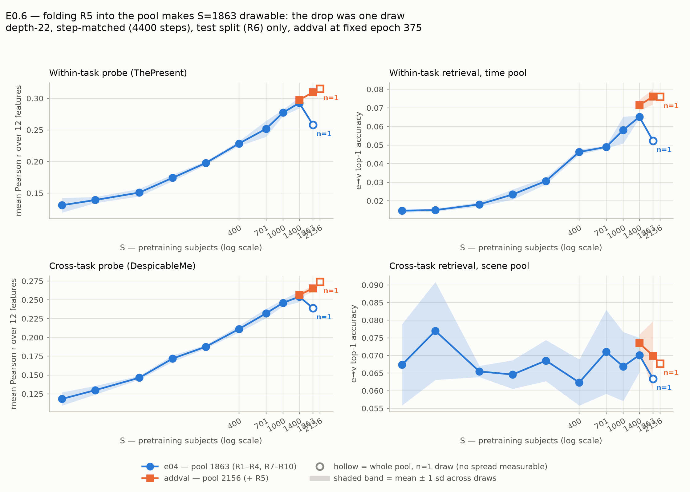
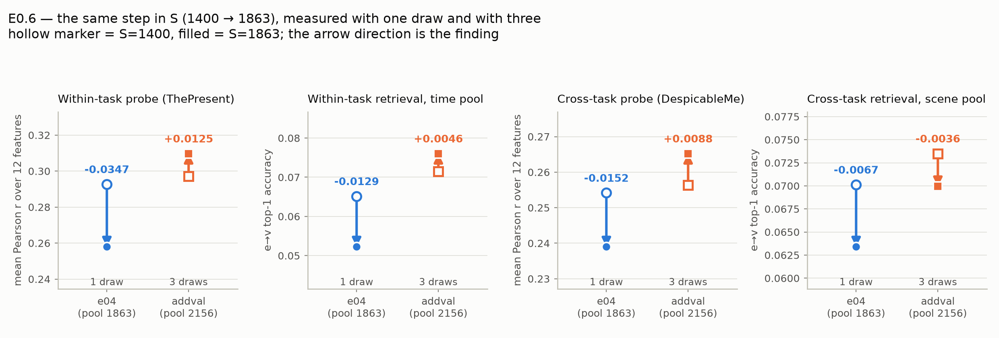

# RESULTS_add_val_set — does the subject-scaling saturation survive a bigger pool?

`RESULTS_model_scaling.md` reports that the depth-22 arm (`e04_reve_scaling`)
rises monotonically with S from 10 through 1400 and then **drops** at the
full-pool S=1863 cell — consistently across both probe tasks, both splits, and
all three retrieval granularities. It also names the reason that drop cannot be
believed as stated: **S=1863 is the whole R1–R4+R7–R10 pool, so it has exactly
one possible draw**, while every other S on that curve is a mean over three.
A single-draw cell is precisely the case that smoothed epoch selection protects
least, and `RESULTS.md` 2.10 documents a prior instance where selection
variance manufactured an apparent scaling artifact in this very experiment.

This file tests it by **folding the val release (R5) into the pretraining
pool**, taking ThePresent from 1863 recordings to 2156. That buys two things a
larger pool alone would not:

1. **S=1863 becomes a drawable cell with three replicates.** 1863 < 2156, so
   `max_subjects=1863` is a real subsample rather than a no-op cap. If three
   independent draws at S=1863 sit at the S=1400 level, the drop was draw or
   selection variance. If they reproduce it, it is a population-level effect.
2. **A genuinely new max-S point at S=2156** — the first observation past the
   previous ceiling of the data.

Everything else is held to e04: same depth-22 architecture, `meta.seed=2025`,
400 epochs, `epoch_size=703` so every cell runs exactly 4400 steps under an
identical LR schedule, `max_anchors=101`, `save_every=25`. The pool line is the
only substantive difference.

All numbers below are generated from the raw JSONs in `raw_results/` by
`src/write_results_add_val_set.py` — re-run that script to regenerate this file.

---

## Verdict: the drop does not reproduce. It was the single draw.

**Three independent draws at S=1863 from the 2156 pool give a within-task probe
mean r of 0.3097 +/- 0.0005** — *above* e04's S=1400 peak (0.2927 +/- 0.0085),
and **+0.052 above e04's single-draw S=1863 (0.2579)**. The three draws agree to
a stdev of 0.0005, which is 17x tighter than e04's own between-draw spread at
S=1400, so this is not a lucky replacement draw.

The decomposition in section 2a is the argument, because it isolates *the same
step in S* measured two ways:

- **S=1400 -> 1863 with three draws (contrast B): +0.0130** on the within-task
  probe, +0.0097 cross-task, positive on 3 of 5 readouts and never below
  -0.003 (inside the draw sd) on the other two.
- **The identical step with one draw (contrast C): -0.0347** within-task,
  -0.0152 cross-task, negative on **all five** readouts.

Same architecture, same recipe, same step in S, opposite sign — and the only
difference is one draw versus three. `RESULTS_model_scaling.md` flagged exactly
this as the reason to distrust its own headline; that caveat turns out to be the
explanation rather than a hedge.

**The comparison is legitimate because the pools are near-exchangeable.** At
matched S=1400 the offset (contrast A) is +0.0041 on the within-task probe
(+0.48 of e04's between-draw sd) and -0.000 on scene retrieval. One exception,
stated rather than buried: **time-pool retrieval is +0.008 (+10 sd)** — small
in absolute terms but well outside noise. The likely cause is subject quality,
not a bug: `RESULTS.md` 2.11 measured R7-R10 subjects as worth 8-15 % less than
R1-R4 at matched count, and R5 belongs to the original block, so a 1400-draw
from the 2156 pool carries ~13.6 % R5 (190 of 1400) where a 1400-draw from 1863
carries none.
That offset is far too small to account for contrast C either way.

**What this does NOT establish.** S=2156 is again *the whole pool*, so it has
one possible draw and inherits precisely the weakness that made e04's S=1863
unreadable. Its +0.0052 over S=1863 (probe) is inside the range a single draw
can produce, and retrieval is flat across that step (-0.000 time, +0.002
scene). The honest reading is **"no evidence of a decline at 2156"**, not "the
curve keeps rising to 2156." Establishing the latter needs a pool larger than
2156 so that S=2156 becomes drawable in triplicate — the same move this file
made for S=1863.

**Consequence for `RESULTS_model_scaling.md`.** Its headline observation, that
every table drops at the full-pool cell, should be withdrawn as a single-draw
artifact rather than reported as a capacity/subject-count interaction. Its
section 1-4 tables remain correct as measurements; it is the interpretation of
the S=1863 row that does not survive.

---

## What R5-in-train costs, and how each cost is handled

**Test split only, both arms, every table.** The addval cells trained on R5, so
a val number for them would be measured on data their encoder saw. R6 (test) is
untouched by both arms and is the only split on which they are comparable at
all. Where `RESULTS_model_scaling.md` reports val and test, this file reports
test.

**Checkpoint selection is a fixed epoch, not a fallback.** e04 picks each
cell's epoch by smoothed argmax of `val/clip_scene_auc` — a signal that is
in-sample for the addval cells and therefore unusable. Those cells are pinned
to **epoch 375**, which is where 4 of 4 high-S e04 cells' own selection landed
(S=1400 d11/d33 and S=1863 at 375; S=1400 d22 at 350), so the arms are matched
to within one 25-epoch checkpoint interval. `save_every=25` keeps the whole
epoch grid on disk, so a different epoch can be evaluated later without
retraining.

**The probe head-fit pool is NOT changed.** `config_probe_TP_e04.yaml` and
`config_probe_DM_e04.yaml` still declare `[R1..R4, R7..R10]`, so every cell in
both arms fits its RidgeCV head on the identical 1863 (ThePresent) / 1832
(DespicableMe) recordings. Only the **encoder's** pretraining cohort varies —
which is what isolates "how good are the features an S-subject encoder learned"
from "how much data did the probe itself see." A cross-task artifact reporting
`n_train_recordings=2156` would mean the probe read the pretraining config
instead of the eval config; the submitters' `verify` action checks for exactly
that.

**Retrieval refits nothing.** It is zero-shot cosine similarity between frozen
EEG and V-JEPA-2 embeddings, so the head-fit caveats apply only to the Pearson
r tables.

**Confirmed at runtime**, job 21138023, rather than assumed:

```
HBN_TRAIN_RELEASES override: train = ['R1','R2','R3','R4','R5','R7','R8','R9','R10']
Scaling subsample: 2156 -> 1400 subjects (2156 -> 1400 recordings)
E0.3 scaling cell: max_subjects=1400 max_anchors=101 epoch_size=703
                   -> 1400 recordings, 703 items/epoch, 11 steps/epoch
```

The pool is 2156 on both counts — one recording per subject, unlike the
R1–R4-only pool where 703 recordings came from 701 subjects — so S means the
same thing in subjects and in recordings throughout this arm. And 703
items/epoch confirms the step budget is unchanged, so the new points are not
confounded with optimisation budget.

---

## Figures



**`figures/addval_subject_scaling.pdf`** — the four readouts as small multiples,
mean line with a shaded +/- 1 sd band across draws. **Hollow markers are
single-draw cells** (`n=1`), drawn without a band because no spread was
measured: e04 at S=1863 and addval at S=2156, each being that arm's whole pool.
That distinction is the experiment, so the figure encodes it rather than
averaging it away.



**`figures/addval_drop_decomposition.pdf`** — the argument in one panel per
readout: the *same* step in S (1400 -> 1863) measured inside e04, where it rests
on one draw, and inside addval, where it rests on three. The arrow direction is
the finding.

Both are written by `src/plot_add_val_set.py`, which imports this script to get
its data -- same cells, same exclusions -- so a figure cannot disagree with a
table above it.

---

## 0. Coverage — what is actually measured

An empty cell in any table below is indistinguishable from a zero unless it is
stated. This is the statement.

| arm | S | TP probe | TP retr | DM probe | DM retr |
|---|---|---|---|---|---|
| e04 (pool 1863) | 10 | 3/3 | 3/3 | 3/3 | 3/3 |
| e04 (pool 1863) | 20 | 3/3 | 3/3 | 3/3 | 3/3 |
| e04 (pool 1863) | 50 | 3/3 | 3/3 | 3/3 | 3/3 |
| e04 (pool 1863) | 100 | 3/3 | 3/3 | 3/3 | 3/3 |
| e04 (pool 1863) | 200 | 3/3 | 3/3 | 3/3 | 3/3 |
| e04 (pool 1863) | 400 | 3/3 | 3/3 | 3/3 | 3/3 |
| e04 (pool 1863) | 701 | 3/3 | 3/3 | 3/3 | 3/3 |
| e04 (pool 1863) | 1000 | 3/3 | 3/3 | 3/3 | 3/3 |
| e04 (pool 1863) | 1400 | 3/3 | 3/3 | 3/3 | 3/3 |
| e04 (pool 1863) | 1863 | 1/1 | 1/1 | 1/1 | 1/1 |
| addval (pool 2156) | 10 | 0/3 | 0/3 | 0/3 | 0/3 |
| addval (pool 2156) | 20 | 0/3 | 0/3 | 0/3 | 0/3 |
| addval (pool 2156) | 50 | 0/3 | 0/3 | 0/3 | 0/3 |
| addval (pool 2156) | 100 | 0/3 | 0/3 | 0/3 | 0/3 |
| addval (pool 2156) | 200 | 0/3 | 0/3 | 0/3 | 0/3 |
| addval (pool 2156) | 400 | 0/3 | 0/3 | 0/3 | 0/3 |
| addval (pool 2156) | 701 | 0/3 | 0/3 | 0/3 | 0/3 |
| addval (pool 2156) | 1000 | 0/3 | 0/3 | 0/3 | 0/3 |
| addval (pool 2156) | 1400 | 3/3 | 3/3 | 3/3 | 3/3 |
| addval (pool 2156) | 1863 | 3/3 | 3/3 | 3/3 | 3/3 |
| addval (pool 2156) | 2156 | 1/1 | 1/1 | 1/1 | 1/1 |

### Epoch per cell

| arm | cell | S | epoch | how chosen |
|---|---|---|---|---|
| e04 (pool 1863) | e04_s10_a101_nd_d11 | 10 | 75 | smoothed val selection |
| e04 (pool 1863) | e04_s10_a101_nd_d22 | 10 | 350 | smoothed val selection |
| e04 (pool 1863) | e04_s10_a101_nd_d33 | 10 | 200 | smoothed val selection |
| e04 (pool 1863) | e04_s20_a101_nd_d11 | 20 | 300 | smoothed val selection |
| e04 (pool 1863) | e04_s20_a101_nd_d22 | 20 | 225 | smoothed val selection |
| e04 (pool 1863) | e04_s20_a101_nd_d33 | 20 | 300 | smoothed val selection |
| e04 (pool 1863) | e04_s50_a101_nd_d11 | 50 | 175 | smoothed val selection |
| e04 (pool 1863) | e04_s50_a101_nd_d22 | 50 | 375 | smoothed val selection |
| e04 (pool 1863) | e04_s50_a101_nd_d33 | 50 | 300 | smoothed val selection |
| e04 (pool 1863) | e04_s100_a101_nd_d11 | 100 | 375 | smoothed val selection |
| e04 (pool 1863) | e04_s100_a101_nd_d22 | 100 | 375 | smoothed val selection |
| e04 (pool 1863) | e04_s100_a101_nd_d33 | 100 | 200 | smoothed val selection |
| e04 (pool 1863) | e04_s200_a101_nd_d11 | 200 | 200 | smoothed val selection |
| e04 (pool 1863) | e04_s200_a101_nd_d22 | 200 | 175 | smoothed val selection |
| e04 (pool 1863) | e04_s200_a101_nd_d33 | 200 | 225 | smoothed val selection |
| e04 (pool 1863) | e04_s400_a101_nd_d11 | 400 | 225 | smoothed val selection |
| e04 (pool 1863) | e04_s400_a101_nd_d22 | 400 | 225 | smoothed val selection |
| e04 (pool 1863) | e04_s400_a101_nd_d33 | 400 | 250 | smoothed val selection |
| e04 (pool 1863) | e04_s701_a101_nd_d11 | 701 | 200 | smoothed val selection |
| e04 (pool 1863) | e04_s701_a101_nd_d22 | 701 | 250 | smoothed val selection |
| e04 (pool 1863) | e04_s701_a101_nd_d33 | 701 | 375 | smoothed val selection |
| e04 (pool 1863) | e04_s1000_a101_nd_d11 | 1000 | 375 | smoothed val selection |
| e04 (pool 1863) | e04_s1000_a101_nd_d22 | 1000 | 200 | smoothed val selection |
| e04 (pool 1863) | e04_s1000_a101_nd_d33 | 1000 | 225 | smoothed val selection |
| e04 (pool 1863) | e04_s1400_a101_nd_d11 | 1400 | 375 | smoothed val selection |
| e04 (pool 1863) | e04_s1400_a101_nd_d22 | 1400 | 350 | smoothed val selection |
| e04 (pool 1863) | e04_s1400_a101_nd_d33 | 1400 | 375 | smoothed val selection |
| e04 (pool 1863) | e04_s1863_a101_nd | 1863 | 375 | smoothed val selection |
| addval (pool 2156) | e05_s10_a101_av_d11 | 10 | 375 | fixed (R5 in train -- no held-out val) |
| addval (pool 2156) | e05_s10_a101_av_d22 | 10 | 375 | fixed (R5 in train -- no held-out val) |
| addval (pool 2156) | e05_s10_a101_av_d33 | 10 | 375 | fixed (R5 in train -- no held-out val) |
| addval (pool 2156) | e05_s20_a101_av_d11 | 20 | 375 | fixed (R5 in train -- no held-out val) |
| addval (pool 2156) | e05_s20_a101_av_d22 | 20 | 375 | fixed (R5 in train -- no held-out val) |
| addval (pool 2156) | e05_s20_a101_av_d33 | 20 | 375 | fixed (R5 in train -- no held-out val) |
| addval (pool 2156) | e05_s50_a101_av_d11 | 50 | 375 | fixed (R5 in train -- no held-out val) |
| addval (pool 2156) | e05_s50_a101_av_d22 | 50 | 375 | fixed (R5 in train -- no held-out val) |
| addval (pool 2156) | e05_s50_a101_av_d33 | 50 | 375 | fixed (R5 in train -- no held-out val) |
| addval (pool 2156) | e05_s100_a101_av_d11 | 100 | 375 | fixed (R5 in train -- no held-out val) |
| addval (pool 2156) | e05_s100_a101_av_d22 | 100 | 375 | fixed (R5 in train -- no held-out val) |
| addval (pool 2156) | e05_s100_a101_av_d33 | 100 | 375 | fixed (R5 in train -- no held-out val) |
| addval (pool 2156) | e05_s200_a101_av_d11 | 200 | 375 | fixed (R5 in train -- no held-out val) |
| addval (pool 2156) | e05_s200_a101_av_d22 | 200 | 375 | fixed (R5 in train -- no held-out val) |
| addval (pool 2156) | e05_s200_a101_av_d33 | 200 | 375 | fixed (R5 in train -- no held-out val) |
| addval (pool 2156) | e05_s400_a101_av_d11 | 400 | 375 | fixed (R5 in train -- no held-out val) |
| addval (pool 2156) | e05_s400_a101_av_d22 | 400 | 375 | fixed (R5 in train -- no held-out val) |
| addval (pool 2156) | e05_s400_a101_av_d33 | 400 | 375 | fixed (R5 in train -- no held-out val) |
| addval (pool 2156) | e05_s701_a101_av_d11 | 701 | 375 | fixed (R5 in train -- no held-out val) |
| addval (pool 2156) | e05_s701_a101_av_d22 | 701 | 375 | fixed (R5 in train -- no held-out val) |
| addval (pool 2156) | e05_s701_a101_av_d33 | 701 | 375 | fixed (R5 in train -- no held-out val) |
| addval (pool 2156) | e05_s1000_a101_av_d11 | 1000 | 375 | fixed (R5 in train -- no held-out val) |
| addval (pool 2156) | e05_s1000_a101_av_d22 | 1000 | 375 | fixed (R5 in train -- no held-out val) |
| addval (pool 2156) | e05_s1000_a101_av_d33 | 1000 | 375 | fixed (R5 in train -- no held-out val) |
| addval (pool 2156) | e05_s1400_a101_av_d11 | 1400 | 375 | fixed (R5 in train -- no held-out val) |
| addval (pool 2156) | e05_s1400_a101_av_d22 | 1400 | 375 | fixed (R5 in train -- no held-out val) |
| addval (pool 2156) | e05_s1400_a101_av_d33 | 1400 | 375 | fixed (R5 in train -- no held-out val) |
| addval (pool 2156) | e05_s1863_a101_av_d11 | 1863 | 375 | fixed (R5 in train -- no held-out val) |
| addval (pool 2156) | e05_s1863_a101_av_d22 | 1863 | 375 | fixed (R5 in train -- no held-out val) |
| addval (pool 2156) | e05_s1863_a101_av_d33 | 1863 | 375 | fixed (R5 in train -- no held-out val) |
| addval (pool 2156) | e05_s2156_a101_av | 2156 | 375 | fixed (R5 in train -- no held-out val) |

---

## 1. Headline — every readout, both arms, test split

| readout | e04 S=10 | e04 S=20 | e04 S=50 | e04 S=100 | e04 S=200 | e04 S=400 | e04 S=701 | e04 S=1000 | e04 S=1400 | e04 S=1863 | addval S=10 | addval S=20 | addval S=50 | addval S=100 | addval S=200 | addval S=400 | addval S=701 | addval S=1000 | addval S=1400 | addval S=1863 | addval S=2156 |
|---|---|---|---|---|---|---|---|---|---|---|---|---|---|---|---|---|---|---|---|---|---|
| TP probe mean(12) r | 0.1309 +/- 0.0116 | 0.1391 +/- 0.0048 | 0.1509 +/- 0.0060 | 0.1742 +/- 0.0051 | 0.1978 +/- 0.0029 | 0.2286 +/- 0.0038 | 0.2518 +/- 0.0127 | 0.2775 +/- 0.0049 | 0.2927 +/- 0.0085 | 0.2579 | - | - | - | - | - | - | - | - | 0.2972 +/- 0.0009 | 0.3097 +/- 0.0005 | 0.3149 |
| TP retr scene e2v@1 | 0.057 +/- 0.002 | 0.060 +/- 0.002 | 0.071 +/- 0.003 | 0.077 +/- 0.008 | 0.086 +/- 0.007 | 0.113 +/- 0.005 | 0.133 +/- 0.008 | 0.131 +/- 0.012 | 0.147 +/- 0.012 | 0.134 | - | - | - | - | - | - | - | - | 0.148 +/- 0.007 | 0.152 +/- 0.009 | 0.154 |
| TP retr time e2v@1 | 0.015 +/- 0.001 | 0.015 +/- 0.001 | 0.018 +/- 0.001 | 0.023 +/- 0.003 | 0.031 +/- 0.002 | 0.046 +/- 0.001 | 0.049 +/- 0.001 | 0.058 +/- 0.007 | 0.065 +/- 0.001 | 0.052 | - | - | - | - | - | - | - | - | 0.071 +/- 0.003 | 0.076 +/- 0.004 | 0.076 |
| DM probe mean(12) r | 0.1182 +/- 0.0088 | 0.1298 +/- 0.0058 | 0.1463 +/- 0.0025 | 0.1719 +/- 0.0043 | 0.1876 +/- 0.0024 | 0.2112 +/- 0.0045 | 0.2320 +/- 0.0061 | 0.2460 +/- 0.0045 | 0.2542 +/- 0.0072 | 0.2390 | - | - | - | - | - | - | - | - | 0.2564 +/- 0.0034 | 0.2652 +/- 0.0044 | 0.2738 |
| DM retr scene e2v@1 | 0.067 +/- 0.012 | 0.077 +/- 0.014 | 0.065 +/- 0.002 | 0.065 +/- 0.004 | 0.069 +/- 0.006 | 0.062 +/- 0.007 | 0.071 +/- 0.012 | 0.067 +/- 0.010 | 0.070 +/- 0.005 | 0.063 | - | - | - | - | - | - | - | - | 0.073 +/- 0.002 | 0.070 +/- 0.010 | 0.068 |

---

## 2. Pool-stitch calibration: the same S from the two pools

The two arms' S=1400 draws are **not** the same cohorts — draws nest within a
pool (permute the subject list once per seed, take the first S), but adding R5
changes the list being permuted. So this is a test of whether the two pools are
exchangeable, and it gates everything else in the file: if the R5-inclusive
pool scores differently at matched S, the S=1863 and S=2156 comparisons must be
read through that offset rather than at face value.

`RESULTS.md` 2.11 measured exactly this kind of pool effect once already —
R7–R10 subjects were worth 8–15 % less than R1–R4 at matched count — so a
non-zero delta here is not hypothetical.

| readout | e04 S=1400 (pool 1863) | addval S=1400 (pool 2156) | delta | delta / e04 sd |
|---|---|---|---|---|
| TP probe mean(12) r | 0.2927 +/- 0.0085 | 0.2972 +/- 0.0009 | +0.0046 | +0.54 |
| TP retr scene e2v@1 | 0.147 +/- 0.012 | 0.148 +/- 0.007 | +0.001 | +0.11 |
| TP retr time e2v@1 | 0.065 +/- 0.001 | 0.071 +/- 0.003 | +0.006 | +8.50 |
| DM probe mean(12) r | 0.2542 +/- 0.0072 | 0.2564 +/- 0.0034 | +0.0023 | +0.31 |
| DM retr scene e2v@1 | 0.070 +/- 0.005 | 0.073 +/- 0.002 | +0.003 | +0.69 |

---

## 2a. Decomposition — pool effect vs S effect vs the alleged drop

| readout | A: pool effect @ S=1400 | B: S 1400->1863, new pool | C: S 1400->1863, e04 | D: S 1863->2156, new pool |
|---|---|---|---|---|
| TP probe mean(12) r | +0.0046 | +0.0125 | -0.0347 | +0.0052 |
| TP retr scene e2v@1 | +0.001 | +0.004 | -0.013 | +0.002 |
| TP retr time e2v@1 | +0.006 | +0.005 | -0.013 | -0.000 |
| DM probe mean(12) r | +0.0023 | +0.0088 | -0.0152 | +0.0086 |
| DM retr scene e2v@1 | +0.003 | -0.004 | -0.007 | -0.002 |

---

## 2d. Matched-epoch calibration — can e04's low-S cells be spliced on?

Sections 1-2a compare e04 at its own smoothed-selected epoch against addval at
a fixed 375. That is matched to within one checkpoint interval at high S, but it
is still two protocols, and at low S e04's selection scatters from epoch 75 to
375 — so a spliced 10 -> 2156 curve built on those numbers would carry a
selection seam exactly where the curve is steepest. `RESULTS.md` 2.10 documents
that epoch selection has already manufactured one fake scaling artifact in this
experiment, so that seam is not a theoretical worry.

This table removes the protocol difference: **every cell here, both arms, is at
fixed epoch 325** (e04's full 28-cell ep325 sweep already existed; the addval
cells were re-evaluated to match). It reports the two OVERLAP points, S=1400 and
S=1863, the only S where both arms have cells.

| readout | S | e04 (pool 1863) | addval (pool 2156) | delta | in e04 sd |
|---|---|---|---|---|---|
| TP probe mean(12) r | 1400 | 0.2910 +/- 0.0081 | 0.2962 +/- 0.0034 | +0.0052 | +0.65 |
| TP probe mean(12) r | 1863 | 0.2531 | 0.3076 +/- 0.0008 | +0.0545 | e04 n=1 |
| DM probe mean(12) r | 1400 | 0.2551 +/- 0.0077 | 0.2567 +/- 0.0032 | +0.0016 | +0.20 |
| DM probe mean(12) r | 1863 | 0.2377 | 0.2649 +/- 0.0049 | +0.0272 | e04 n=1 |
| TP retr time e2v@1 | 1400 | 0.0647 +/- 0.0014 | 0.0714 +/- 0.0046 | +0.0068 | +4.90 |
| TP retr time e2v@1 | 1863 | 0.0523 | 0.0762 +/- 0.0054 | +0.0239 | e04 n=1 |
| TP retr shot e2v@1 | 1400 | 0.1151 +/- 0.0021 | 0.1177 +/- 0.0079 | +0.0025 | +1.18 |
| TP retr shot e2v@1 | 1863 | 0.0893 | 0.1221 +/- 0.0036 | +0.0328 | e04 n=1 |
| TP retr scene e2v@1 | 1400 | 0.1479 +/- 0.0080 | 0.1574 +/- 0.0132 | +0.0095 | +1.19 |
| TP retr scene e2v@1 | 1863 | 0.1356 | 0.1429 +/- 0.0055 | +0.0073 | e04 n=1 |
| DM retr scene e2v@1 | 1400 | 0.0703 +/- 0.0089 | 0.0695 +/- 0.0020 | -0.0008 | -0.09 |
| DM retr scene e2v@1 | 1863 | 0.0590 | 0.0696 +/- 0.0062 | +0.0106 | e04 n=1 |

**Read the S=1400 rows as the calibration** — both arms have three draws there,
so the delta is a pool effect with the epoch effect held at zero. Five of six
readouts land within +/-1.2 of e04's own between-draw sd, i.e. the pools are
exchangeable for the probe (both tasks) and for shot/scene retrieval.

**The exception is time-pool retrieval, at +4.90 sd** (+0.0068, ~+10 % relative).
Matching the epoch halved it — it was +10.4 sd at 375 — so part of the original
gap was protocol, but a real pool effect survives on the finest-granularity
readout. Direction and size match `RESULTS.md` 2.11, which measured R7-R10
subjects as worth 8-15 % less per subject than R1-R4: R5 belongs to the original
block, so a draw from the 2156 pool is slightly richer in good subjects.

**Consequence.** A curve spliced at S=1000/1400 is defensible for the probe and
coarse retrieval with this calibration quoted, and calibrated stitching is
already this experiment's convention (`_submit_e03.py`'s `EXTENDED_CELLS`
stitched R1-R4 onto R1-R10 the same way). It is NOT defensible for time-pool
retrieval, where it would put a visible ~10 % step at the seam. A single-pool
curve requires training the low-S cells from the 2156 pool
(`_submit_e05_addval.py --full-axis`).

**Do not read the S=1863 rows as calibration.** e04 has one draw there, so that
delta mixes the pool effect with the single-draw artifact this file is about —
it is the finding, restated at a second fixed epoch, not a control.

---

## 2b. Every cell, no averaging

| arm | S | draw | TP probe mean(12) r | TP retr time e2v@1 | TP retr scene e2v@1 | DM probe mean(12) r |
|---|---|---|---|---|---|---|
| e04 (pool 1863) | 10 | 11 | 0.1207 | 0.014 | 0.055 | 0.1122 |
| e04 (pool 1863) | 10 | 22 | 0.1434 | 0.015 | 0.059 | 0.1283 |
| e04 (pool 1863) | 10 | 33 | 0.1285 | 0.015 | 0.056 | 0.1142 |
| e04 (pool 1863) | 20 | 11 | 0.1407 | 0.014 | 0.058 | 0.1352 |
| e04 (pool 1863) | 20 | 22 | 0.1430 | 0.016 | 0.062 | 0.1237 |
| e04 (pool 1863) | 20 | 33 | 0.1338 | 0.015 | 0.061 | 0.1306 |
| e04 (pool 1863) | 50 | 11 | 0.1573 | 0.018 | 0.070 | 0.1488 |
| e04 (pool 1863) | 50 | 22 | 0.1498 | 0.017 | 0.070 | 0.1438 |
| e04 (pool 1863) | 50 | 33 | 0.1455 | 0.019 | 0.075 | 0.1464 |
| e04 (pool 1863) | 100 | 11 | 0.1684 | 0.026 | 0.082 | 0.1684 |
| e04 (pool 1863) | 100 | 22 | 0.1767 | 0.021 | 0.067 | 0.1766 |
| e04 (pool 1863) | 100 | 33 | 0.1775 | 0.024 | 0.082 | 0.1706 |
| e04 (pool 1863) | 200 | 11 | 0.2009 | 0.031 | 0.085 | 0.1904 |
| e04 (pool 1863) | 200 | 22 | 0.1973 | 0.029 | 0.094 | 0.1862 |
| e04 (pool 1863) | 200 | 33 | 0.1951 | 0.032 | 0.080 | 0.1863 |
| e04 (pool 1863) | 400 | 11 | 0.2265 | 0.045 | 0.116 | 0.2065 |
| e04 (pool 1863) | 400 | 22 | 0.2264 | 0.046 | 0.107 | 0.2119 |
| e04 (pool 1863) | 400 | 33 | 0.2330 | 0.048 | 0.115 | 0.2153 |
| e04 (pool 1863) | 701 | 11 | 0.2571 | 0.048 | 0.140 | 0.2346 |
| e04 (pool 1863) | 701 | 22 | 0.2609 | 0.049 | 0.135 | 0.2365 |
| e04 (pool 1863) | 701 | 33 | 0.2373 | 0.049 | 0.125 | 0.2250 |
| e04 (pool 1863) | 1000 | 11 | 0.2830 | 0.066 | 0.134 | 0.2452 |
| e04 (pool 1863) | 1000 | 22 | 0.2756 | 0.054 | 0.117 | 0.2508 |
| e04 (pool 1863) | 1000 | 33 | 0.2738 | 0.054 | 0.141 | 0.2421 |
| e04 (pool 1863) | 1400 | 11 | 0.2874 | 0.065 | 0.134 | 0.2547 |
| e04 (pool 1863) | 1400 | 22 | 0.2881 | 0.066 | 0.157 | 0.2467 |
| e04 (pool 1863) | 1400 | 33 | 0.3025 | 0.065 | 0.150 | 0.2611 |
| e04 (pool 1863) | 1863 | - | 0.2579 | 0.052 | 0.134 | 0.2390 |
| addval (pool 2156) | 10 | 11 | - | - | - | - |
| addval (pool 2156) | 10 | 22 | - | - | - | - |
| addval (pool 2156) | 10 | 33 | - | - | - | - |
| addval (pool 2156) | 20 | 11 | - | - | - | - |
| addval (pool 2156) | 20 | 22 | - | - | - | - |
| addval (pool 2156) | 20 | 33 | - | - | - | - |
| addval (pool 2156) | 50 | 11 | - | - | - | - |
| addval (pool 2156) | 50 | 22 | - | - | - | - |
| addval (pool 2156) | 50 | 33 | - | - | - | - |
| addval (pool 2156) | 100 | 11 | - | - | - | - |
| addval (pool 2156) | 100 | 22 | - | - | - | - |
| addval (pool 2156) | 100 | 33 | - | - | - | - |
| addval (pool 2156) | 200 | 11 | - | - | - | - |
| addval (pool 2156) | 200 | 22 | - | - | - | - |
| addval (pool 2156) | 200 | 33 | - | - | - | - |
| addval (pool 2156) | 400 | 11 *(reseeded)* | - | - | - | - |
| addval (pool 2156) | 400 | 22 | - | - | - | - |
| addval (pool 2156) | 400 | 33 | - | - | - | - |
| addval (pool 2156) | 701 | 11 | - | - | - | - |
| addval (pool 2156) | 701 | 22 | - | - | - | - |
| addval (pool 2156) | 701 | 33 *(reseeded)* | - | - | - | - |
| addval (pool 2156) | 1000 | 11 *(reseeded)* | - | - | - | - |
| addval (pool 2156) | 1000 | 22 | - | - | - | - |
| addval (pool 2156) | 1000 | 33 | - | - | - | - |
| addval (pool 2156) | 1400 | 11 *(reseeded)* | 0.2982 | 0.069 | 0.151 | 0.2582 |
| addval (pool 2156) | 1400 | 22 | 0.2964 | 0.074 | 0.140 | 0.2584 |
| addval (pool 2156) | 1400 | 33 | 0.2971 | 0.072 | 0.154 | 0.2525 |
| addval (pool 2156) | 1863 | 11 | 0.3095 | 0.077 | 0.141 | 0.2702 |
| addval (pool 2156) | 1863 | 22 | 0.3103 | 0.072 | 0.157 | 0.2618 |
| addval (pool 2156) | 1863 | 33 | 0.3094 | 0.080 | 0.158 | 0.2637 |
| addval (pool 2156) | 2156 | - | 0.3149 | 0.076 | 0.154 | 0.2738 |

**e05_s1400_a101_av_d11 — reseeded.** failed to converge at seed 2026 and was re-run at --meta.seed=7, the same remedy e04 applied to its own three `_FAILED_seed2026` cells. Detected by `_submit_e05_addval.py screen`, which flags a cell whose final training loss exceeds 1.30x the median of its own S group -- relative, because loss scales with cohort size (S=10 sits near 0.70, S=1863 near 2.8), so a fixed cutoff would miss the same failure at low S. On this arm the three genuine failures sat at 1.67-3.09x their group median while the worst healthy cell was 1.19x. Superseded runs are kept as `<cell>_FAILED_seed2026` on Delta with their artifacts under `raw_results/_failed_e05_*`. This cell: time-pool e2v@1 0.017/0.017/0.018 at epochs 300/350/375 (flat, at the 0.010 random baseline) vs siblings' 0.066-0.074; final loss 3.9 vs 2.8. Not an unlucky cohort -- the S=1863 d11 cell, a strict superset of this cohort, trained normally. Re-run gives 0.068/0.067/0.069 and clip_scene_auc 0.875 at ep375 (was 0.607).

**e05_s400_a101_av_d11 — reseeded.** failed to converge at seed 2026 and was re-run at --meta.seed=7, the same remedy e04 applied to its own three `_FAILED_seed2026` cells. Detected by `_submit_e05_addval.py screen`, which flags a cell whose final training loss exceeds 1.30x the median of its own S group -- relative, because loss scales with cohort size (S=10 sits near 0.70, S=1863 near 2.8), so a fixed cutoff would miss the same failure at low S. On this arm the three genuine failures sat at 1.67-3.09x their group median while the worst healthy cell was 1.19x. Superseded runs are kept as `<cell>_FAILED_seed2026` on Delta with their artifacts under `raw_results/_failed_e05_*`. This cell: final loss 4.02 = 3.09x its S=400 median; clip_scene_auc@375 0.532 vs siblings' 0.742/0.800.

**e05_s701_a101_av_d33 — reseeded.** failed to converge at seed 2026 and was re-run at --meta.seed=7, the same remedy e04 applied to its own three `_FAILED_seed2026` cells. Detected by `_submit_e05_addval.py screen`, which flags a cell whose final training loss exceeds 1.30x the median of its own S group -- relative, because loss scales with cohort size (S=10 sits near 0.70, S=1863 near 2.8), so a fixed cutoff would miss the same failure at low S. On this arm the three genuine failures sat at 1.67-3.09x their group median while the worst healthy cell was 1.19x. Superseded runs are kept as `<cell>_FAILED_seed2026` on Delta with their artifacts under `raw_results/_failed_e05_*`. This cell: final loss 4.07 = 1.89x its S=701 median; time-pool e2v@1 0.0123 against the 0.0099 random baseline, vs siblings' 0.053/0.058.

**e05_s1000_a101_av_d11 — reseeded.** failed to converge at seed 2026 and was re-run at --meta.seed=7, the same remedy e04 applied to its own three `_FAILED_seed2026` cells. Detected by `_submit_e05_addval.py screen`, which flags a cell whose final training loss exceeds 1.30x the median of its own S group -- relative, because loss scales with cohort size (S=10 sits near 0.70, S=1863 near 2.8), so a fixed cutoff would miss the same failure at low S. On this arm the three genuine failures sat at 1.67-3.09x their group median while the worst healthy cell was 1.19x. Superseded runs are kept as `<cell>_FAILED_seed2026` on Delta with their artifacts under `raw_results/_failed_e05_*`. This cell: final loss 4.16 = 1.67x its S=1000 median; time-pool e2v@1 0.0116 (random 0.0099) vs siblings' 0.0640/0.0640.

---

## 2c. Epoch robustness

| arm | S | draw | ep300 | ep350 | ep375 (primary) |
|---|---|---|---|---|---|
| addval (pool 2156) | 10 | 11 | - | - | - |
| addval (pool 2156) | 10 | 22 | - | - | - |
| addval (pool 2156) | 10 | 33 | - | - | - |
| addval (pool 2156) | 20 | 11 | - | - | - |
| addval (pool 2156) | 20 | 22 | - | - | - |
| addval (pool 2156) | 20 | 33 | - | - | - |
| addval (pool 2156) | 50 | 11 | - | - | - |
| addval (pool 2156) | 50 | 22 | - | - | - |
| addval (pool 2156) | 50 | 33 | - | - | - |
| addval (pool 2156) | 100 | 11 | - | - | - |
| addval (pool 2156) | 100 | 22 | - | - | - |
| addval (pool 2156) | 100 | 33 | - | - | - |
| addval (pool 2156) | 200 | 11 | - | - | - |
| addval (pool 2156) | 200 | 22 | - | - | - |
| addval (pool 2156) | 200 | 33 | - | - | - |
| addval (pool 2156) | 400 | 11 (reseeded) | - | - | - |
| addval (pool 2156) | 400 | 22 | - | - | - |
| addval (pool 2156) | 400 | 33 | - | - | - |
| addval (pool 2156) | 701 | 11 | - | - | - |
| addval (pool 2156) | 701 | 22 | - | - | - |
| addval (pool 2156) | 701 | 33 (reseeded) | - | - | - |
| addval (pool 2156) | 1000 | 11 (reseeded) | - | - | - |
| addval (pool 2156) | 1000 | 22 | - | - | - |
| addval (pool 2156) | 1000 | 33 | - | - | - |
| addval (pool 2156) | 1400 | 11 (reseeded) | 0.068 | 0.067 | 0.069 |
| addval (pool 2156) | 1400 | 22 | 0.067 | 0.070 | 0.074 |
| addval (pool 2156) | 1400 | 33 | 0.066 | 0.070 | 0.072 |
| addval (pool 2156) | 1863 | 11 | 0.070 | 0.077 | 0.077 |
| addval (pool 2156) | 1863 | 22 | 0.070 | 0.069 | 0.072 |
| addval (pool 2156) | 1863 | 33 | 0.076 | 0.075 | 0.080 |
| addval (pool 2156) | 2156 | - | 0.072 | 0.074 | 0.076 |

TP retrieval, time pool, e2v top-1, test split.

---

## 3. Within-task (ThePresent) probe — Pearson r, test split

RidgeCV head fit on the full 1863-recording pool for every cell in both arms.
Mean +/- stdev across draws; a single value where only one draw exists.

| arm | S | n | luminance_mean | contrast_rms | edge_density | saturation_mean | entropy | motion_energy | n_faces | face_area_frac | depth_mean | scene_natural_score | position_in_movie | narrative_event_score | mean(12) |
|---|---|---|---|---|---|---|---|---|---|---|---|---|---|---|---|
| e04 (pool 1863) | 10 | 3/3 | 0.1983 +/- 0.0137 | 0.1853 +/- 0.0137 | 0.0934 +/- 0.0117 | 0.1841 +/- 0.0157 | 0.1945 +/- 0.0188 | 0.0956 +/- 0.0093 | 0.0838 +/- 0.0081 | 0.0722 +/- 0.0077 | 0.0917 +/- 0.0058 | 0.0926 +/- 0.0121 | 0.2112 +/- 0.0141 | 0.0680 +/- 0.0177 | **0.1309** |
| e04 (pool 1863) | 20 | 3/3 | 0.2033 +/- 0.0045 | 0.1893 +/- 0.0050 | 0.0997 +/- 0.0114 | 0.1887 +/- 0.0056 | 0.1983 +/- 0.0031 | 0.1222 +/- 0.0018 | 0.0895 +/- 0.0065 | 0.0754 +/- 0.0060 | 0.0975 +/- 0.0034 | 0.1124 +/- 0.0156 | 0.2129 +/- 0.0011 | 0.0803 +/- 0.0063 | **0.1391** |
| e04 (pool 1863) | 50 | 3/3 | 0.2111 +/- 0.0029 | 0.2036 +/- 0.0051 | 0.1096 +/- 0.0120 | 0.1968 +/- 0.0079 | 0.2037 +/- 0.0107 | 0.1410 +/- 0.0018 | 0.1078 +/- 0.0152 | 0.0756 +/- 0.0166 | 0.1189 +/- 0.0053 | 0.1159 +/- 0.0083 | 0.2287 +/- 0.0100 | 0.0979 +/- 0.0084 | **0.1509** |
| e04 (pool 1863) | 100 | 3/3 | 0.2368 +/- 0.0099 | 0.2265 +/- 0.0058 | 0.1250 +/- 0.0099 | 0.2223 +/- 0.0108 | 0.2291 +/- 0.0046 | 0.1663 +/- 0.0194 | 0.1347 +/- 0.0133 | 0.1011 +/- 0.0165 | 0.1358 +/- 0.0087 | 0.1468 +/- 0.0050 | 0.2504 +/- 0.0116 | 0.1153 +/- 0.0083 | **0.1742** |
| e04 (pool 1863) | 200 | 3/3 | 0.2563 +/- 0.0075 | 0.2354 +/- 0.0021 | 0.1568 +/- 0.0039 | 0.2358 +/- 0.0098 | 0.2376 +/- 0.0089 | 0.2156 +/- 0.0129 | 0.1603 +/- 0.0027 | 0.1330 +/- 0.0033 | 0.1616 +/- 0.0036 | 0.1778 +/- 0.0054 | 0.2628 +/- 0.0042 | 0.1403 +/- 0.0070 | **0.1978** |
| e04 (pool 1863) | 400 | 3/3 | 0.2809 +/- 0.0093 | 0.2637 +/- 0.0049 | 0.1891 +/- 0.0139 | 0.2587 +/- 0.0137 | 0.2616 +/- 0.0064 | 0.2597 +/- 0.0096 | 0.1935 +/- 0.0061 | 0.1645 +/- 0.0006 | 0.1946 +/- 0.0067 | 0.2096 +/- 0.0049 | 0.2841 +/- 0.0165 | 0.1833 +/- 0.0065 | **0.2286** |
| e04 (pool 1863) | 701 | 3/3 | 0.3010 +/- 0.0173 | 0.2835 +/- 0.0151 | 0.2217 +/- 0.0047 | 0.2759 +/- 0.0157 | 0.2800 +/- 0.0145 | 0.2816 +/- 0.0092 | 0.2175 +/- 0.0127 | 0.1896 +/- 0.0212 | 0.2145 +/- 0.0153 | 0.2376 +/- 0.0107 | 0.3092 +/- 0.0150 | 0.2094 +/- 0.0076 | **0.2518** |
| e04 (pool 1863) | 1000 | 3/3 | 0.3333 +/- 0.0064 | 0.3081 +/- 0.0008 | 0.2495 +/- 0.0073 | 0.3046 +/- 0.0067 | 0.3096 +/- 0.0016 | 0.3175 +/- 0.0081 | 0.2391 +/- 0.0073 | 0.2128 +/- 0.0048 | 0.2370 +/- 0.0114 | 0.2629 +/- 0.0041 | 0.3328 +/- 0.0063 | 0.2225 +/- 0.0036 | **0.2775** |
| e04 (pool 1863) | 1400 | 3/3 | 0.3448 +/- 0.0088 | 0.3249 +/- 0.0112 | 0.2722 +/- 0.0059 | 0.3155 +/- 0.0102 | 0.3184 +/- 0.0118 | 0.3332 +/- 0.0098 | 0.2567 +/- 0.0075 | 0.2305 +/- 0.0074 | 0.2525 +/- 0.0091 | 0.2791 +/- 0.0098 | 0.3431 +/- 0.0062 | 0.2412 +/- 0.0108 | **0.2927** |
| e04 (pool 1863) | 1863 | 1/1 | 0.3159 | 0.2897 | 0.2115 | 0.2880 | 0.2875 | 0.2888 | 0.2218 | 0.1853 | 0.2152 | 0.2608 | 0.3226 | 0.2081 | **0.2579** |
| addval (pool 2156) | 1400 | 3/3 | 0.3517 +/- 0.0034 | 0.3255 +/- 0.0055 | 0.2735 +/- 0.0088 | 0.3190 +/- 0.0048 | 0.3217 +/- 0.0064 | 0.3442 +/- 0.0138 | 0.2600 +/- 0.0034 | 0.2386 +/- 0.0161 | 0.2599 +/- 0.0074 | 0.2809 +/- 0.0035 | 0.3461 +/- 0.0060 | 0.2456 +/- 0.0019 | **0.2972** |
| addval (pool 2156) | 1863 | 3/3 | 0.3644 +/- 0.0020 | 0.3399 +/- 0.0039 | 0.2882 +/- 0.0056 | 0.3373 +/- 0.0067 | 0.3380 +/- 0.0070 | 0.3655 +/- 0.0070 | 0.2710 +/- 0.0029 | 0.2377 +/- 0.0023 | 0.2719 +/- 0.0007 | 0.2923 +/- 0.0015 | 0.3590 +/- 0.0033 | 0.2513 +/- 0.0113 | **0.3097** |
| addval (pool 2156) | 2156 | 1/1 | 0.3744 | 0.3481 | 0.2868 | 0.3438 | 0.3497 | 0.3648 | 0.2750 | 0.2347 | 0.2755 | 0.2954 | 0.3713 | 0.2592 | **0.3149** |
| random | - | - | 0.1402 | 0.1273 | 0.0653 | 0.1352 | 0.1501 | 0.0818 | 0.0930 | 0.0826 | 0.0731 | 0.0958 | 0.1488 | 0.0659 | **0.1049** |

---

## 4. Within-task retrieval — test split

e2v: given an EEG window, is the matching vision pool entry in the top-K by
cosine similarity? v2e: the reverse. "xChance" is top-1 divided by 1/N_pool.

### 4.1 Time-bucket pools (finest, N~101)

| arm | S | n | e2v@1 | e2v@5 | e2v@10 | e2v@1 (xChance) | v2e@1 | v2e@5 | v2e@10 | v2e@1 (xChance) | N_pool |
|---|---|---|---|---|---|---|---|---|---|---|---|
| e04 (pool 1863) | 10 | 3/3 | 0.015 | 0.062 | 0.121 | 1.48x | 0.010 | 0.053 | 0.096 | 1.00x | 101 |
| e04 (pool 1863) | 20 | 3/3 | 0.015 | 0.071 | 0.134 | 1.52x | 0.010 | 0.046 | 0.096 | 1.00x | 101 |
| e04 (pool 1863) | 50 | 3/3 | 0.018 | 0.080 | 0.156 | 1.83x | 0.013 | 0.050 | 0.102 | 1.33x | 101 |
| e04 (pool 1863) | 100 | 3/3 | 0.023 | 0.100 | 0.183 | 2.36x | 0.010 | 0.046 | 0.099 | 1.00x | 101 |
| e04 (pool 1863) | 200 | 3/3 | 0.031 | 0.122 | 0.218 | 3.10x | 0.010 | 0.056 | 0.112 | 1.00x | 101 |
| e04 (pool 1863) | 400 | 3/3 | 0.046 | 0.161 | 0.267 | 4.68x | 0.013 | 0.063 | 0.106 | 1.33x | 101 |
| e04 (pool 1863) | 701 | 3/3 | 0.049 | 0.174 | 0.284 | 4.94x | 0.020 | 0.050 | 0.079 | 2.00x | 101 |
| e04 (pool 1863) | 1000 | 3/3 | 0.058 | 0.193 | 0.306 | 5.86x | 0.020 | 0.066 | 0.102 | 2.00x | 101 |
| e04 (pool 1863) | 1400 | 3/3 | 0.065 | 0.207 | 0.331 | 6.58x | 0.010 | 0.059 | 0.122 | 1.00x | 101 |
| e04 (pool 1863) | 1863 | 1/1 | 0.052 | 0.195 | 0.321 | 5.28x | 0.020 | 0.069 | 0.109 | 2.00x | 101 |
| addval (pool 2156) | 1400 | 3/3 | 0.071 | 0.214 | 0.335 | 7.22x | 0.026 | 0.063 | 0.112 | 2.67x | 101 |
| addval (pool 2156) | 1863 | 3/3 | 0.076 | 0.224 | 0.346 | 7.68x | 0.010 | 0.056 | 0.106 | 1.00x | 101 |
| addval (pool 2156) | 2156 | 1/1 | 0.076 | 0.227 | 0.353 | 7.67x | 0.040 | 0.050 | 0.079 | 4.00x | 101 |
| random | - | - | 0.010 | 0.050 | 0.099 | 1.00x | 0.010 | 0.050 | 0.089 | 1.00x | 101 |

### 4.2 Shot pools

| arm | S | n | e2v@1 | e2v@5 | e2v@10 | e2v@1 (xChance) | v2e@1 | v2e@5 | v2e@10 | v2e@1 (xChance) | N_pool |
|---|---|---|---|---|---|---|---|---|---|---|---|
| e04 (pool 1863) | 10 | 3/3 | 0.034 | 0.139 | 0.252 | 1.69x | 0.020 | 0.102 | 0.156 | 1.00x | 49 |
| e04 (pool 1863) | 20 | 3/3 | 0.038 | 0.150 | 0.258 | 1.88x | 0.020 | 0.088 | 0.163 | 1.00x | 49 |
| e04 (pool 1863) | 50 | 3/3 | 0.045 | 0.169 | 0.296 | 2.21x | 0.027 | 0.095 | 0.204 | 1.33x | 49 |
| e04 (pool 1863) | 100 | 3/3 | 0.051 | 0.190 | 0.313 | 2.50x | 0.020 | 0.102 | 0.170 | 1.00x | 49 |
| e04 (pool 1863) | 200 | 3/3 | 0.064 | 0.230 | 0.366 | 3.16x | 0.020 | 0.109 | 0.211 | 1.00x | 49 |
| e04 (pool 1863) | 400 | 3/3 | 0.084 | 0.275 | 0.430 | 4.10x | 0.027 | 0.122 | 0.218 | 1.33x | 49 |
| e04 (pool 1863) | 701 | 3/3 | 0.092 | 0.320 | 0.479 | 4.49x | 0.041 | 0.102 | 0.156 | 2.00x | 49 |
| e04 (pool 1863) | 1000 | 3/3 | 0.100 | 0.322 | 0.493 | 4.89x | 0.041 | 0.116 | 0.184 | 2.00x | 49 |
| e04 (pool 1863) | 1400 | 3/3 | 0.117 | 0.359 | 0.528 | 5.73x | 0.020 | 0.116 | 0.238 | 1.00x | 49 |
| e04 (pool 1863) | 1863 | 1/1 | 0.091 | 0.329 | 0.503 | 4.46x | 0.041 | 0.143 | 0.204 | 2.00x | 49 |
| addval (pool 2156) | 1400 | 3/3 | 0.120 | 0.359 | 0.531 | 5.90x | 0.048 | 0.122 | 0.197 | 2.33x | 49 |
| addval (pool 2156) | 1863 | 3/3 | 0.123 | 0.377 | 0.549 | 6.05x | 0.020 | 0.102 | 0.170 | 1.00x | 49 |
| addval (pool 2156) | 2156 | 1/1 | 0.121 | 0.377 | 0.546 | 5.95x | 0.061 | 0.082 | 0.102 | 3.00x | 49 |
| random | - | - | 0.014 | 0.077 | 0.166 | 0.68x | 0.020 | 0.102 | 0.122 | 1.00x | 49 |

### 4.3 Scene pools (coarsest)

| arm | S | n | e2v@1 | e2v@5 | e2v@10 | e2v@1 (xChance) | v2e@1 | v2e@5 | v2e@10 | v2e@1 (xChance) | N_pool |
|---|---|---|---|---|---|---|---|---|---|---|---|
| e04 (pool 1863) | 10 | 3/3 | 0.057 | 0.224 | 0.372 | 1.99x | 0.019 | 0.143 | 0.190 | 0.67x | 35 |
| e04 (pool 1863) | 20 | 3/3 | 0.060 | 0.230 | 0.370 | 2.11x | 0.029 | 0.114 | 0.238 | 1.00x | 35 |
| e04 (pool 1863) | 50 | 3/3 | 0.071 | 0.258 | 0.411 | 2.50x | 0.038 | 0.124 | 0.267 | 1.33x | 35 |
| e04 (pool 1863) | 100 | 3/3 | 0.077 | 0.270 | 0.423 | 2.69x | 0.029 | 0.143 | 0.257 | 1.00x | 35 |
| e04 (pool 1863) | 200 | 3/3 | 0.086 | 0.314 | 0.470 | 3.02x | 0.029 | 0.143 | 0.276 | 1.00x | 35 |
| e04 (pool 1863) | 400 | 3/3 | 0.113 | 0.371 | 0.547 | 3.95x | 0.038 | 0.152 | 0.248 | 1.33x | 35 |
| e04 (pool 1863) | 701 | 3/3 | 0.133 | 0.432 | 0.598 | 4.67x | 0.057 | 0.133 | 0.210 | 2.00x | 35 |
| e04 (pool 1863) | 1000 | 3/3 | 0.131 | 0.438 | 0.623 | 4.58x | 0.057 | 0.162 | 0.257 | 2.00x | 35 |
| e04 (pool 1863) | 1400 | 3/3 | 0.147 | 0.475 | 0.659 | 5.15x | 0.029 | 0.162 | 0.305 | 1.00x | 35 |
| e04 (pool 1863) | 1863 | 1/1 | 0.134 | 0.438 | 0.612 | 4.68x | 0.057 | 0.171 | 0.286 | 2.00x | 35 |
| addval (pool 2156) | 1400 | 3/3 | 0.148 | 0.479 | 0.660 | 5.19x | 0.067 | 0.152 | 0.257 | 2.33x | 35 |
| addval (pool 2156) | 1863 | 3/3 | 0.152 | 0.499 | 0.673 | 5.32x | 0.029 | 0.133 | 0.229 | 1.00x | 35 |
| addval (pool 2156) | 2156 | 1/1 | 0.154 | 0.495 | 0.680 | 5.39x | 0.086 | 0.114 | 0.143 | 3.00x | 35 |
| random | - | - | 0.026 | 0.120 | 0.241 | 0.92x | 0.029 | 0.143 | 0.171 | 1.00x | 35 |

---

## 5. Cross-task (DespicableMe) probe — Pearson r, test split

Same ThePresent-trained checkpoints, RidgeCV head refit on DespicableMe's own
1832-recording train pool. Linear transfer of the learned features, not
zero-shot alignment (that is section 6).

| arm | S | n | luminance_mean | contrast_rms | edge_density | saturation_mean | entropy | motion_energy | n_faces | face_area_frac | depth_mean | scene_natural_score | position_in_movie | narrative_event_score | mean(12) |
|---|---|---|---|---|---|---|---|---|---|---|---|---|---|---|---|
| e04 (pool 1863) | 10 | 3/3 | 0.1318 +/- 0.0085 | 0.1056 +/- 0.0063 | 0.1274 +/- 0.0170 | 0.1220 +/- 0.0103 | 0.1232 +/- 0.0056 | 0.1076 +/- 0.0100 | 0.0984 +/- 0.0137 | 0.1172 +/- 0.0116 | 0.1145 +/- 0.0053 | 0.1298 +/- 0.0155 | 0.1678 +/- 0.0142 | 0.0735 +/- 0.0162 | **0.1182** |
| e04 (pool 1863) | 20 | 3/3 | 0.1504 +/- 0.0088 | 0.1137 +/- 0.0083 | 0.1398 +/- 0.0095 | 0.1317 +/- 0.0110 | 0.1332 +/- 0.0071 | 0.1219 +/- 0.0076 | 0.1098 +/- 0.0045 | 0.1324 +/- 0.0047 | 0.1196 +/- 0.0140 | 0.1344 +/- 0.0082 | 0.1910 +/- 0.0044 | 0.0804 +/- 0.0031 | **0.1298** |
| e04 (pool 1863) | 50 | 3/3 | 0.1689 +/- 0.0059 | 0.1334 +/- 0.0049 | 0.1595 +/- 0.0054 | 0.1463 +/- 0.0047 | 0.1515 +/- 0.0031 | 0.1494 +/- 0.0082 | 0.1192 +/- 0.0052 | 0.1390 +/- 0.0111 | 0.1354 +/- 0.0042 | 0.1638 +/- 0.0063 | 0.1946 +/- 0.0103 | 0.0952 +/- 0.0017 | **0.1463** |
| e04 (pool 1863) | 100 | 3/3 | 0.1964 +/- 0.0064 | 0.1625 +/- 0.0062 | 0.1958 +/- 0.0105 | 0.1740 +/- 0.0062 | 0.1821 +/- 0.0100 | 0.1783 +/- 0.0160 | 0.1368 +/- 0.0068 | 0.1524 +/- 0.0067 | 0.1518 +/- 0.0070 | 0.1858 +/- 0.0063 | 0.2246 +/- 0.0088 | 0.1222 +/- 0.0085 | **0.1719** |
| e04 (pool 1863) | 200 | 3/3 | 0.2072 +/- 0.0054 | 0.1699 +/- 0.0034 | 0.2076 +/- 0.0060 | 0.1851 +/- 0.0047 | 0.1920 +/- 0.0023 | 0.1969 +/- 0.0167 | 0.1570 +/- 0.0052 | 0.1720 +/- 0.0072 | 0.1712 +/- 0.0054 | 0.2025 +/- 0.0008 | 0.2497 +/- 0.0116 | 0.1405 +/- 0.0103 | **0.1876** |
| e04 (pool 1863) | 400 | 3/3 | 0.2338 +/- 0.0034 | 0.2026 +/- 0.0081 | 0.2453 +/- 0.0094 | 0.2160 +/- 0.0024 | 0.2210 +/- 0.0045 | 0.2234 +/- 0.0089 | 0.1634 +/- 0.0130 | 0.1839 +/- 0.0127 | 0.1915 +/- 0.0096 | 0.2226 +/- 0.0039 | 0.2752 +/- 0.0086 | 0.1560 +/- 0.0039 | **0.2112** |
| e04 (pool 1863) | 701 | 3/3 | 0.2565 +/- 0.0097 | 0.2209 +/- 0.0021 | 0.2743 +/- 0.0058 | 0.2327 +/- 0.0051 | 0.2502 +/- 0.0083 | 0.2519 +/- 0.0142 | 0.1801 +/- 0.0127 | 0.1936 +/- 0.0118 | 0.2072 +/- 0.0042 | 0.2449 +/- 0.0121 | 0.2986 +/- 0.0018 | 0.1734 +/- 0.0030 | **0.2320** |
| e04 (pool 1863) | 1000 | 3/3 | 0.2718 +/- 0.0066 | 0.2353 +/- 0.0068 | 0.2786 +/- 0.0043 | 0.2508 +/- 0.0115 | 0.2606 +/- 0.0043 | 0.2720 +/- 0.0150 | 0.1909 +/- 0.0057 | 0.2038 +/- 0.0046 | 0.2180 +/- 0.0057 | 0.2584 +/- 0.0071 | 0.3145 +/- 0.0003 | 0.1975 +/- 0.0147 | **0.2460** |
| e04 (pool 1863) | 1400 | 3/3 | 0.2820 +/- 0.0091 | 0.2483 +/- 0.0069 | 0.2843 +/- 0.0117 | 0.2722 +/- 0.0027 | 0.2642 +/- 0.0121 | 0.2728 +/- 0.0122 | 0.2010 +/- 0.0047 | 0.2109 +/- 0.0087 | 0.2260 +/- 0.0045 | 0.2699 +/- 0.0100 | 0.3224 +/- 0.0052 | 0.1958 +/- 0.0107 | **0.2542** |
| e04 (pool 1863) | 1863 | 1/1 | 0.2613 | 0.2246 | 0.2719 | 0.2548 | 0.2463 | 0.2481 | 0.1976 | 0.2013 | 0.1982 | 0.2606 | 0.3128 | 0.1904 | **0.2390** |
| addval (pool 2156) | 1400 | 3/3 | 0.2857 +/- 0.0062 | 0.2507 +/- 0.0087 | 0.2954 +/- 0.0088 | 0.2700 +/- 0.0060 | 0.2732 +/- 0.0036 | 0.2782 +/- 0.0035 | 0.1973 +/- 0.0046 | 0.2015 +/- 0.0030 | 0.2283 +/- 0.0057 | 0.2737 +/- 0.0064 | 0.3273 +/- 0.0029 | 0.1956 +/- 0.0070 | **0.2564** |
| addval (pool 2156) | 1863 | 3/3 | 0.2898 +/- 0.0116 | 0.2523 +/- 0.0122 | 0.3011 +/- 0.0080 | 0.2740 +/- 0.0092 | 0.2742 +/- 0.0111 | 0.2957 +/- 0.0087 | 0.2113 +/- 0.0097 | 0.2211 +/- 0.0125 | 0.2366 +/- 0.0167 | 0.2795 +/- 0.0073 | 0.3389 +/- 0.0020 | 0.2081 +/- 0.0096 | **0.2652** |
| addval (pool 2156) | 2156 | 1/1 | 0.3097 | 0.2656 | 0.3205 | 0.2831 | 0.2859 | 0.3067 | 0.2062 | 0.2158 | 0.2367 | 0.2912 | 0.3407 | 0.2233 | **0.2738** |
| random | - | - | 0.0740 | 0.0754 | 0.1255 | 0.0900 | 0.1008 | 0.1058 | 0.0928 | 0.1120 | 0.1057 | 0.1042 | 0.1238 | 0.0771 | **0.0989** |

---

## 6. Cross-task retrieval — zero-shot alignment on DespicableMe, test split

Nothing is refit. The strictest transfer test available: does a
ThePresent-trained EEG encoder still land in the right place in V-JEPA-2 space
for a movie it never saw during pretraining?

### 6.1 Time-bucket pools

| arm | S | n | e2v@1 | e2v@5 | e2v@10 | e2v@1 (xChance) | v2e@1 | v2e@5 | v2e@10 | v2e@1 (xChance) | N_pool |
|---|---|---|---|---|---|---|---|---|---|---|---|
| e04 (pool 1863) | 10 | 3/3 | 0.012 | 0.061 | 0.122 | 0.99x | 0.008 | 0.051 | 0.118 | 0.67x | 85 |
| e04 (pool 1863) | 20 | 3/3 | 0.013 | 0.064 | 0.125 | 1.11x | 0.016 | 0.051 | 0.110 | 1.33x | 85 |
| e04 (pool 1863) | 50 | 3/3 | 0.013 | 0.063 | 0.122 | 1.08x | 0.008 | 0.067 | 0.110 | 0.67x | 85 |
| e04 (pool 1863) | 100 | 3/3 | 0.013 | 0.068 | 0.134 | 1.11x | 0.012 | 0.063 | 0.114 | 1.00x | 85 |
| e04 (pool 1863) | 200 | 3/3 | 0.015 | 0.074 | 0.141 | 1.30x | 0.012 | 0.051 | 0.106 | 1.00x | 85 |
| e04 (pool 1863) | 400 | 3/3 | 0.015 | 0.072 | 0.141 | 1.30x | 0.016 | 0.059 | 0.102 | 1.33x | 85 |
| e04 (pool 1863) | 701 | 3/3 | 0.016 | 0.072 | 0.141 | 1.37x | 0.012 | 0.055 | 0.098 | 1.00x | 85 |
| e04 (pool 1863) | 1000 | 3/3 | 0.016 | 0.076 | 0.145 | 1.36x | 0.012 | 0.051 | 0.098 | 1.00x | 85 |
| e04 (pool 1863) | 1400 | 3/3 | 0.018 | 0.080 | 0.152 | 1.52x | 0.012 | 0.047 | 0.086 | 1.00x | 85 |
| e04 (pool 1863) | 1863 | 1/1 | 0.014 | 0.075 | 0.146 | 1.15x | 0.012 | 0.047 | 0.071 | 1.00x | 85 |
| addval (pool 2156) | 1400 | 3/3 | 0.016 | 0.079 | 0.152 | 1.37x | 0.016 | 0.051 | 0.094 | 1.33x | 85 |
| addval (pool 2156) | 1863 | 3/3 | 0.016 | 0.079 | 0.150 | 1.34x | 0.012 | 0.047 | 0.098 | 1.00x | 85 |
| addval (pool 2156) | 2156 | 1/1 | 0.016 | 0.084 | 0.155 | 1.39x | 0.012 | 0.047 | 0.071 | 1.00x | 85 |
| random | - | - | 0.011 | 0.057 | 0.117 | 0.96x | 0.012 | 0.059 | 0.118 | 1.00x | 85 |

### 6.2 Shot pools

| arm | S | n | e2v@1 | e2v@5 | e2v@10 | e2v@1 (xChance) | v2e@1 | v2e@5 | v2e@10 | v2e@1 (xChance) | N_pool |
|---|---|---|---|---|---|---|---|---|---|---|---|
| e04 (pool 1863) | 10 | 3/3 | 0.040 | 0.182 | 0.324 | 1.28x | 0.031 | 0.146 | 0.281 | 1.00x | 32 |
| e04 (pool 1863) | 20 | 3/3 | 0.046 | 0.199 | 0.346 | 1.46x | 0.052 | 0.115 | 0.250 | 1.67x | 32 |
| e04 (pool 1863) | 50 | 3/3 | 0.041 | 0.182 | 0.328 | 1.32x | 0.021 | 0.177 | 0.271 | 0.67x | 32 |
| e04 (pool 1863) | 100 | 3/3 | 0.044 | 0.198 | 0.354 | 1.40x | 0.031 | 0.146 | 0.260 | 1.00x | 32 |
| e04 (pool 1863) | 200 | 3/3 | 0.048 | 0.214 | 0.380 | 1.54x | 0.031 | 0.115 | 0.229 | 1.00x | 32 |
| e04 (pool 1863) | 400 | 3/3 | 0.045 | 0.206 | 0.376 | 1.44x | 0.031 | 0.125 | 0.250 | 1.00x | 32 |
| e04 (pool 1863) | 701 | 3/3 | 0.051 | 0.235 | 0.413 | 1.65x | 0.031 | 0.135 | 0.229 | 1.00x | 32 |
| e04 (pool 1863) | 1000 | 3/3 | 0.048 | 0.231 | 0.412 | 1.53x | 0.031 | 0.135 | 0.250 | 1.00x | 32 |
| e04 (pool 1863) | 1400 | 3/3 | 0.052 | 0.247 | 0.431 | 1.67x | 0.031 | 0.135 | 0.219 | 1.00x | 32 |
| e04 (pool 1863) | 1863 | 1/1 | 0.051 | 0.227 | 0.393 | 1.64x | 0.031 | 0.094 | 0.188 | 1.00x | 32 |
| addval (pool 2156) | 1400 | 3/3 | 0.052 | 0.245 | 0.430 | 1.66x | 0.042 | 0.135 | 0.219 | 1.33x | 32 |
| addval (pool 2156) | 1863 | 3/3 | 0.051 | 0.246 | 0.438 | 1.63x | 0.031 | 0.135 | 0.250 | 1.00x | 32 |
| addval (pool 2156) | 2156 | 1/1 | 0.055 | 0.240 | 0.430 | 1.77x | 0.031 | 0.156 | 0.219 | 1.00x | 32 |
| random | - | - | 0.092 | 0.293 | 0.464 | 2.96x | 0.031 | 0.156 | 0.219 | 1.00x | 32 |

### 6.3 Scene pools

| arm | S | n | e2v@1 | e2v@5 | e2v@10 | e2v@1 (xChance) | v2e@1 | v2e@5 | v2e@10 | v2e@1 (xChance) | N_pool |
|---|---|---|---|---|---|---|---|---|---|---|---|
| e04 (pool 1863) | 10 | 3/3 | 0.067 | 0.235 | 0.392 | 1.75x | 0.038 | 0.154 | 0.308 | 1.00x | 26 |
| e04 (pool 1863) | 20 | 3/3 | 0.077 | 0.252 | 0.418 | 2.00x | 0.064 | 0.141 | 0.295 | 1.67x | 26 |
| e04 (pool 1863) | 50 | 3/3 | 0.065 | 0.233 | 0.400 | 1.70x | 0.026 | 0.218 | 0.308 | 0.67x | 26 |
| e04 (pool 1863) | 100 | 3/3 | 0.065 | 0.243 | 0.422 | 1.68x | 0.038 | 0.154 | 0.282 | 1.00x | 26 |
| e04 (pool 1863) | 200 | 3/3 | 0.069 | 0.262 | 0.446 | 1.78x | 0.038 | 0.141 | 0.256 | 1.00x | 26 |
| e04 (pool 1863) | 400 | 3/3 | 0.062 | 0.250 | 0.447 | 1.62x | 0.038 | 0.141 | 0.282 | 1.00x | 26 |
| e04 (pool 1863) | 701 | 3/3 | 0.071 | 0.285 | 0.485 | 1.85x | 0.038 | 0.154 | 0.269 | 1.00x | 26 |
| e04 (pool 1863) | 1000 | 3/3 | 0.067 | 0.280 | 0.486 | 1.74x | 0.038 | 0.167 | 0.308 | 1.00x | 26 |
| e04 (pool 1863) | 1400 | 3/3 | 0.070 | 0.302 | 0.504 | 1.82x | 0.038 | 0.154 | 0.256 | 1.00x | 26 |
| e04 (pool 1863) | 1863 | 1/1 | 0.063 | 0.269 | 0.462 | 1.65x | 0.038 | 0.115 | 0.231 | 1.00x | 26 |
| addval (pool 2156) | 1400 | 3/3 | 0.073 | 0.302 | 0.502 | 1.91x | 0.051 | 0.154 | 0.244 | 1.33x | 26 |
| addval (pool 2156) | 1863 | 3/3 | 0.070 | 0.300 | 0.511 | 1.82x | 0.038 | 0.167 | 0.269 | 1.00x | 26 |
| addval (pool 2156) | 2156 | 1/1 | 0.068 | 0.296 | 0.503 | 1.76x | 0.038 | 0.192 | 0.231 | 1.00x | 26 |
| random | - | - | 0.106 | 0.331 | 0.516 | 2.76x | 0.038 | 0.192 | 0.269 | 1.00x | 26 |

---

## Provenance

- Training: `submit/_submit_e05_addval.py` (7 cells) ->
  `/work/hdd/bbnv/dtyoung/eb_jepa/e05_addval`. Frozen config
  `config/clip_pretrain_e05_addval.yaml`, which is kkokate's e04 training
  config with `data.train_releases` extended by R5 and nothing else.
- e04 reference side: `/work/hdd/bbnv/kkokate/eb_jepa/e04_reve_scaling`
  (read-only; nothing in this pipeline writes there), at the epochs in
  `e04_selection.json`.
- Evaluation: `submit/_submit_traintest_e04.py --arm addval` and
  `submit/_submit_retrieval_e04.py --arm addval` (`within` / `cross` presets).
  Both restrict the addval arm to the test split and pin it to epoch 375; both
  are idempotent (every step is skip-if-output-exists) and both support a
  `verify` action that checks `n_train_recordings` against the expected
  head-fit pool.
- Eval configs: `config/config_probe_TP_e04.yaml`,
  `config/config_probe_DM_e04.yaml` — shared with the e04 arm, unmodified.
- Figures: `src/plot_add_val_set.py` -> `figures/addval_subject_scaling.{png,pdf}`,
  `figures/addval_drop_decomposition.{png,pdf}`.
- Raw JSONs: `raw_results/{e04_tt_test,e04_retr_test}_e05_*` and
  `raw_results/{xtask_tt_DMtest,xtask_retr_DMtest}_e05_*` (addval arm); the
  same prefixes with `e04_*` slugs (reference arm).
