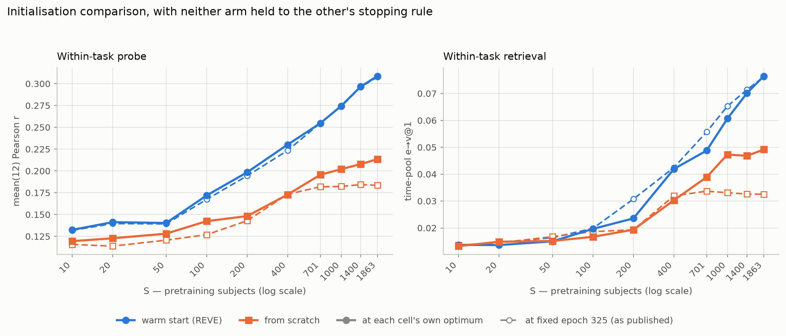
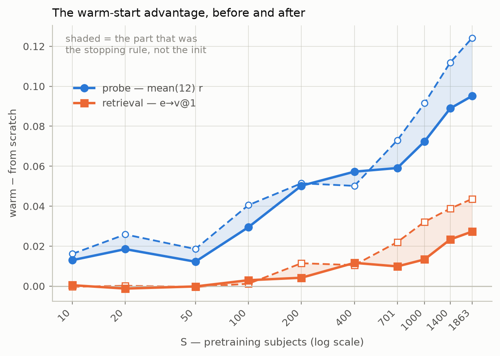
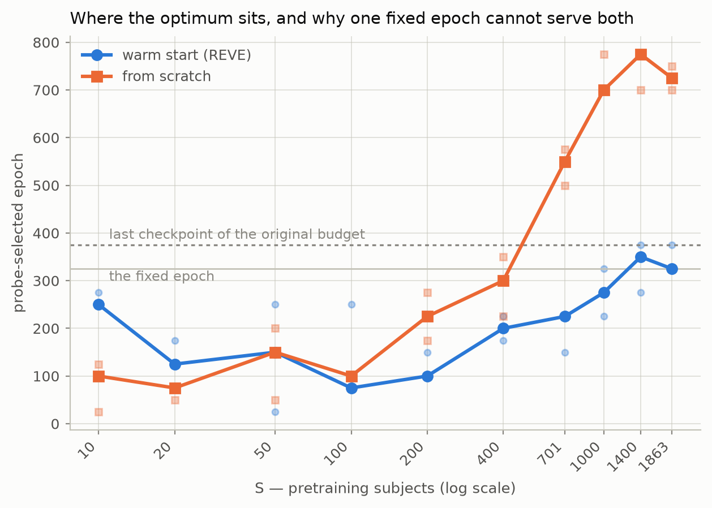

# Review draft — the comparison with each cell at its own optimum

Generated from `raw_results/` by `src/write_results_optimum.py`. Figures by
`src/plot_optimum_comparison.py`. **Nothing here is in the paper yet.**

## What was measured, and why

Both arms of the initialisation comparison were evaluated at a single fixed
epoch. Epoch curves on held-out data showed that epoch is not neutral between
them: it sits near the warm-started arm's broad optimum, and far from the
from-scratch arm's. Worse, above S=701 the from-scratch arm's optimum lay
*outside its training budget* — it was stopped before it converged. So part of
the published gap is the stopping rule rather than the initialisation.

Three things were done about it:

1. Every cell of both arms was given a per-cell epoch, selected on data it
   never trained on (each draw's cohort complement — 293 subjects).
2. The from-scratch arm was **retrained at double the budget** where the
   original was binding (S≥701, 13 cells, 8800 steps).
3. Both arms were fully re-evaluated at those epochs: probe and retrieval,
   within- and cross-task, test split. 240 artifacts.

## 1. Headline — the gap, before and after

| readout | gap at fixed 325 | gap at each cell's optimum | protocol share |
|---|---|---|---|
| within probe | 0.1001 | 0.0789 | 21 % |
| within retrieval | 0.0342 | 0.0185 | 46 % |
| cross probe | 0.0785 | 0.0729 | 7 % |
| cross retrieval | 0.0028 | 0.0019 | 32 % |

Averaged over S≥701, where the budget was binding. **The warm start survives
on every readout.** What changes is how much of it is real.

## 2. The qualitative finding: the from-scratch retrieval plateau is not real

At the fixed epoch the from-scratch arm's within-task retrieval stops
responding to subject count above S=701 — which reads as an arm that has
stopped converting subjects into signal. At each cell's own optimum it keeps
rising.

| S | at fixed 325 | at its own optimum |
|---|---|---|
| 701 | 0.0337 | 0.0389 |
| 1000 | 0.0331 | 0.0473 |
| 1400 | 0.0326 | 0.0468 |
| 1863 | 0.0325 | 0.0492 |

Across S=701→1863 that is **-0.0011 at the fixed epoch against
+0.0103 at the optimum** — flat-to-declining becomes clearly rising.
`submit/_submit_e05_addval.py` already carried this as a suspicion in a
comment ("so under-trained that subject count stops mattering"); it is now
measured, and it was right.

## 3. Why one fixed epoch could not serve both arms

| S | warm optimum | from-scratch optimum |
|---|---|---|
| 10 | 100/250/275 | 25/100/125 |
| 20 | 125/125/175 | 50/75/125 |
| 50 | 25/150/250 | 50/150/200 |
| 100 | 75/75/250 | 75/100/100 |
| 200 | 100/100/150 | 175/225/275 |
| 400 | 175/200/225 | 225/300/350 |
| 701 | 150/225/225 | 500/550/575 |
| 1000 | 225/275/325 | 700/700/775 |
| 1400 | 275/350/375 | 700/775/775 |
| 1863 | 325/325/375 | 700/725/750 |

The from-scratch optimum travels the length of the ladder; the warm-started
one barely moves. A fixed 325 is therefore *late* for the from-scratch arm at
small S and *far too early* at large S, while being roughly right for the warm
arm throughout. That asymmetry is the whole confound.

## 4. What per-cell selection did to each arm separately

| readout | warm: fixed → optimum | from scratch: fixed → optimum |
|---|---|---|
| within probe | 0.2128 → 0.2149 (+0.0021) | 0.1525 → 0.1653 (+0.0128) |
| within retrieval | 0.0406 → 0.0383 (-0.0022) | 0.0247 → 0.0292 (+0.0045) |
| cross probe | 0.1904 → 0.1917 (+0.0014) | 0.1359 → 0.1419 (+0.0059) |
| cross retrieval | 0.0148 → 0.0145 (-0.0004) | 0.0131 → 0.0129 (-0.0002) |

**The warm arm barely moves; the from-scratch arm gains substantially.** That
is the confound stated as directly as it can be: the published protocol was
already right for one arm and wrong for the other.

On the warm arm specifically, per-cell selection is a **trade rather than a
gain** — it buys a little probe and costs a little retrieval, both inside the
~0.003 between-draw spread. That is the argument for leaving the official
curve at a fixed epoch: the change is only load-bearing for the *baseline*.

## 5. Depth, at matched pool and matched budget

The depth-12 arm was retrained on the 2156 pool so it draws cohorts from the
same pool with the same seeds as the depth-22 from-scratch arm. Draw 11 of each
therefore trains on the **identical subjects**, which makes this a paired
comparison rather than two independent samples. Both arms use 800 epochs above
S=701 and each cell sits at its own optimum.

| readout | depth 12 | depth 22 | paired diff | pairs favouring d12 | paired sd |
|---|---|---|---|---|---|
| within probe | 0.2159 | 0.2078 | +0.0081 | 9/9 | 0.0041 |
| within retrieval | 0.0631 | 0.0478 | +0.0153 | 9/9 | 0.0036 |
| cross probe | 0.1762 | 0.1811 | -0.0049 | 1/9 | 0.0058 |
| cross retrieval | 0.0145 | 0.0138 | +0.0006 | 5/9 | 0.0014 |

Averaged over S>=1000, where the arms separate. **The shallower model is better
on the training task; the deeper one transfers better.** The sign flips between
within-task and cross-task, which is why a single "which depth is better"
answer does not exist.

This replaces a null. The appendix reports that the two from-scratch arms *do
not separate anywhere*; that comparison put a pool-1863 depth-12 arm against
pool-2156 depth-22 arms, at a fixed epoch suiting neither, with both arms
truncated above S=701. None of those apply here.

**Quote these with their strengths, which differ a lot:**

- **within probe** (+0.0081): solid — 2x its paired sd, unanimous for depth-12.
- **within retrieval** (+0.0153): firmest — 4x its paired sd, 9/9 favouring depth-12.
- **cross probe** (-0.0049): weakest — its paired sd (0.0058) exceeds the effect, so it rests on 8/9 of pairs favouring depth-22; report the direction, not the size.
- **cross retrieval** (+0.0006): no reliable direction — 5/9 is near a coin flip and the values sit at the chance floor; carries nothing.

**Residual truncation does not explain it.** Both arms rest at optima of
500--775, both pin at the last checkpoint on 3 of 12 high-S cells, and both
gain +0.0002 over their final 75 epochs — flat pinning, where the argmax lands
at the end because the curve is level and noise picks the bin. Over 600->775
every cell of both arms gains a uniform +0.0038 to +0.0067. The residual is
symmetric and an order of magnitude below the depth differences above.

## Decisions this leaves open

1. **Does the official curve move to per-cell epochs?** Recommendation: no.
   On the warm arm the change is a wash, and a fixed epoch is simpler to state.
2. **Does the initialisation comparison move?** Recommendation: yes. Leaving
   it as published compares a converged arm against a truncated one.
3. **How to present S=2156.** It is the one cell with no cohort complement, so
   it has no held-out data to select on and stays at a fixed epoch while the
   other ten sit at their optima. It is already the hollow, unreplicable point
   excluded from every fit, but the protocol seam should be stated rather than
   left for a reader to notice.
4. **How much of §warmstart needs rewriting** — at minimum the retrieval
   plateau claim, which is now known to be an artifact.

## Provenance

| what | where |
|---|---|
| epoch curves | `raw_results/{addval,fromscratch,fromscratch800}_epoch_curve.json` |
| selections | `raw_results/addval_selection_probe.json`, `raw_results/fromscratch_optimum_selection.json` |
| re-evaluations | `raw_results/*_epprb.json` (240 artifacts) |
| comparison | `src/analyse_optimum_comparison.py` |
| figures | `src/plot_optimum_comparison.py` |
| this file | `src/write_results_optimum.py` |

The from-scratch selection is a composite: 800-epoch checkpoints at S≥701,
original checkpoints below, since the longer budget was worth exactly 0.0000
there. Budget routing was verified on all 120 output filenames.
